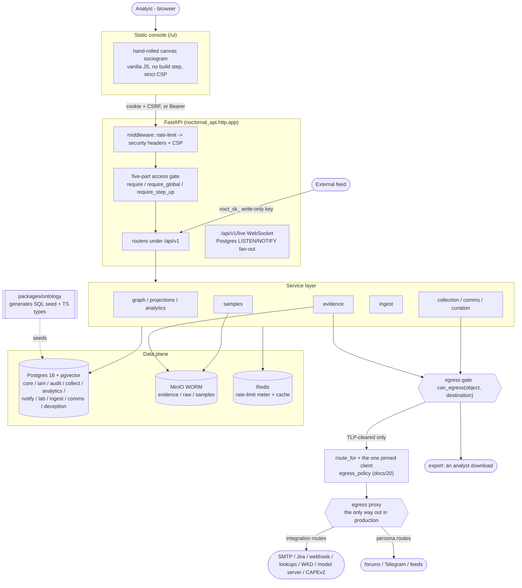

# NocTORnal: Architecture

NocTORnal is a HUMINT and social-network-analysis platform for cybercrime
investigation. Analysts build a graph of criminal actors, personas and groups
and the trust between them; every node attribute and every edge traces to
graded, custody-tracked evidence, and the machine-assisted parts of the
pipeline propose rather than decide. Comparable products: SL Crimewall,
Maltego, i2 Analyst's Notebook, UCINET (for the SNA maths), Obsidian (for the
linked-notes feel).

> **Standing.** This is a derived map, not a decision record. Where it
> disagrees with `docs/00-decisions.md` (the numbered decisions),
> `docs/16-legal-and-external.md` (the blocking legal items) or
> `docs/17-flagged-for-review.md` (what is known-wrong), those are
> authoritative and this is stale.

This document is the system map: the founding ideas, the twelve invariants and
how each is enforced, the ten build phases (0 through 9) and how they depend on
one another, then a layer-by-layer tour of the data model, ontology, graph and
analytics, API, security, storage, collection, UI and stack, closing with the
load-bearing decisions and the legal gates enforced in code.

> **Freshness.** Surveyed 2026-07-25, counters and stack refreshed since, at
> **Alembic head 0124** and **6094 tests** (`def test_` functions across both
> pytest roots, a figure `scripts/refresh_counters.py` maintains and
> `test_doc_invariants` holds to the tree exactly). It follows the code, not
> the original design intent: where the two diverged (front-end stack, UUID
> version, pagination style, the authorisation engine and queue that were
> never wired) this document says so rather than describing the aspiration as
> if it were built. Companion documents: `docs/00-decisions.md` (the numbered
> decisions), `docs/09-roadmap.md` (what each phase was for),
> `docs/20-outbound-connections.md` (the outbound contract: the address
> policy, the one client, routes and the egress proxy),
> `docs/16-legal-and-external.md` (the blocking legal items),
> `CONVENTIONS.md` (the working agreement and the twelve invariants), and
> `db/schema.sql` (the generated schema mirror, `db/README.md`).

## The three ideas everything follows from

**A handle is not a person.** `IDENTITY` (what was observed, a persona,
account, handle) and `PERSON` (who an analyst assesses them to be) are separate
node types, joined only by `ATTRIBUTED_TO`, an edge that carries a confidence
and is reversible. The entire discipline of attribution lives in that gap;
collapsing it into one record means a wrong call can never be cleanly unwound.

**Nothing is a fact.** Every attribute and every edge traces to at least one
`core.assertion` row carrying a source, an Admiralty grading, an ICD-203
confidence, a basis and two timestamps. The graph an analyst sees is a
*projection* of current, non-retracted assertions. Retract a source and the
network changes.

**Machines propose, analysts dispose.** Extractors and inference jobs write to
`collect.proposal`; they cannot write a node or edge. A human accepts a
proposal into the graph, where it is born as an inferred assertion. A graph
that invents links is worse than no graph, because it looks authoritative.

## System map

Everything an analyst reaches is same-origin: the static console under `/ui`
and the REST API under `/api/v1` are served by one FastAPI process, so there is
no CORS surface. Every case-scoped request passes the five-part gate before a
service runs. Every graph write carries an assertion. Every outbound path funnels
through one TLP egress gate, every outbound connection through one client and
one address policy, and in production through the egress proxy, the only way out
of the deployment (docs/20).

## The twelve invariants and how each is enforced

The invariants in `CONVENTIONS.md` are not aspirations, each has an enforcement
point in code or in the database, and a test named after it. Where enforcement
is in the database it holds against any write path, including a mistaken one.

| # | Invariant | Where it is actually enforced |
|---|---|---|
| 1 | Nothing is a fact | **Database.** A symmetric pair of `DEFERRABLE INITIALLY DEFERRED` constraint triggers (migration `0022`): `node_requires_assertion` / `edge_requires_assertion` reject any element with no assertion by commit; `assertion_protects_element` rejects deleting or repointing the *last* assertion of a live element. `graph.py` `GraphWriteService` writes element + assertion in one transaction on top of it (decision 24). |
| 2 | A handle is not a person | `IDENTITY` and `PERSON` are distinct node types joined only by `ATTRIBUTED_TO`. `validate_edge_endpoints` (`0016`) blocks `SAME_AS` crossing the IDENTITY/PERSON layer; `merges.py` refuses a merge across the same boundary (decisions 1, 21). |
| 3 | Machines propose, analysts dispose | `collect.proposal` is the only extractor target; `ProposalStore` holds no `GraphWriteService` and physically cannot write the graph. `ProposalReview.accept` (permission `proposal.review`) is the sole path in, needs a human `reviewed_by`, and creates edges `is_inferred=True` with basis `AUTOMATED_INFERENCE` (decision 7). |
| 4 | Inferred edges stay distinct | `core.edge.is_inferred`; projections exclude them unless `include_inferred`; SNA metrics exclude non-`is_social_tie` edges; the UI renders inferred edges dashed. |
| 5 | History superseded, never overwritten | Retraction is a marked row, not a supersession (decided 2026-09-09): one `UPDATE` stamps `retracted_at`/`retracted_by`/`retraction_reason`, guarded by `WHERE retracted_at IS NULL` so it applies once, and `retract_assertion` errors on a 0-row update; the claim's own columns are never written again (`test_invariant_5_a_retraction_is_one_stamp_and_rewrites_nothing`). `superseded_at`/`superseded_by` exist (0007) and the read side honours them, but no code path writes them yet. A correction is a retraction plus a new assertion. "At least one *live* assertion" is a projection property, deliberately not write-enforced, so an element can dissolve from the live graph while its rows persist for replay. |
| 6 | Audit append-only | `audit.event`: `block_mutation()` on UPDATE/DELETE/TRUNCATE + `REVOKE`, and a hash chain via `chain_hash()` under an advisory xact lock over a UTC-canonical column render (`0013`). |
| 7 | Credentials never leave the vault | `collection.py` `PersonaVault` exposes no `get_secret()`, only a `use(...)` context manager that decrypts an envelope-sealed secret, yields it to a block and drops it, auditing every use; errors are `redact()`-ed before they reach a log. **The vault runs inside the API process** (there is no separate collector), so this is a guarantee about the shape of the code, not a network boundary: a compromised API host is a compromised vault. Reworded 2026-09-09 from "never leave the collector", which the topology never backed. `ProviderVault` (`providers.py`) holds lookup provider keys the same way, each key bound to the origin and egress route it was entered for, and an exposure approval is bound to the provider's origin and network. An egress exit is sealed to the egress proxy's own key, and the API holds only its public half (`security/egress_seal.py`). Every outbound path is operator-configured, labelled, audited and capped by a ceiling, and in production the egress proxy is the only way out (decision 68, docs/20). |
| 8 | TLP gates egress | `egress.py` `can_egress()` / `enforce_egress()`: `NEVER_EGRESS = {AMBER_STRICT, RED}` is checked before any per-destination ceiling, one function shared by every outbound path (export, SMTP, webhooks, Jira, outbound lookups, Web Key Directories, the model server, the CAPEv2 sandbox and collection targets), failing closed on an unknown classification or a destination with no gate record (decisions 38 and 85). Every destination that crosses the boundary keeps the floor and refuses compartmented material by construction, and all but the four original ones require a declared ceiling. |
| 9 | Durable identifiers, not displayed ones | The ontology encodes each split as a strong/weak selector pair sharing no normalised value: `TOX_PK` (64-hex) vs `TOX_ID_FULL` (rotatable nospam), `TELEGRAM_ID` (numeric) vs `TELEGRAM_USER` (`@username`). `is_strong` gates the merge lead (`StrongSelectorConflict`; merges are human-initiated); a rotated-nospam regression test pins it. |
| 10 | Samples never render, never execute | `SampleService.download` serves bytes only on a process CONFIGURED as the sample origin -- `samples.origin_split()` decides from `NOCTORNAL_SAMPLE_ORIGIN`, `NOCTORNAL_BASE_URL` and `NOCTORNAL_PUBLIC_ORIGIN` alone and never reads the request (until 2026-09-09 it compared against `request.url`, which Starlette builds from the Host header); it refuses when the variable is unset (the split is OFF and every download refuses), when it is not an origin, when it equals the application origin, or on any process that is not the sample origin, naming the origin to fetch from; bytes ship `application/octet-stream` under `Content-Security-Policy: default-src 'none'; sandbox`; the object key is the SHA-256, never the filename; no sandbox combines `allow-scripts` with `allow-same-origin`. |
| 11 | Ingest keys are write-only | Keys carry the `noct_sk_` prefix and a `CHECK` forbids a `case:read` scope on `ingest.api_key`; `POST /ingest` is the only endpoint a key can reach. A leaked ingest key means junk data, never the case file. |
| 12 | Nothing silently dropped | Unparseable ingest goes to `ingest.dead_letter` with the raw fragment, `error_class` and `parser_version`; a contact-block line that cannot be resolved is stored `UNPARSED`; a failed analytics run is marked `FAILED`, never silently absent. |

---

## The phases and how they link

Each phase is independently useful; the numbering runs Phase 0 through Phase 9. Status figures are the four-dimension completion weights from `ROADMAP-REMAINING.md` (model+tests 45%, HTTP API 15%, analyst UI 25%, adversarial review 15%), as scored at Alpha 6; the roadmap features built since (F1 to F15, L1 to L6 and S2) are named in each row and are scored when they are released, after their review. **As of 2026-08-10 every phase has an HTTP API, an analyst pane and a COMPLETE adversarial review**, Phase 6 was the last, and its pass closed the `merges.py` / `retention.py` / `approvals.py` / `break_glass.py` gap this line used to name. The recurring gap is now feature work rather than reach or scrutiny.

| Phase | Name | What it delivers | Depends on | Current status |
|---|---|---|---|---|
| 0 | Foundation | Monorepo, Docker Compose, Alembic, ontology to Py/TS codegen, Argon2id+TOTP auth, one five-part access gate, hash-chained `audit.event`, CI gates |, | **complete, 100%.** Model+tests done, API done, UI done, reviewed. No typecheck by decision 42. |
| 1 | Graph core | Case CRUD, node/edge CRUD, assertion layer (`graph.py` `GraphWriteService`), selectors, evidence to MinIO WORM + custody ledger, tags, FTS | 0 (auth, gate, audit) | **complete, 100%.** All four dimensions done. |
| 2 | Sociogram | Projection presets, graph API (neighbourhood/path/subgraph/as-of), canvas sociogram, inspector, live local metrics | 1 (graph, assertion, projections) | **partial, 95%.** Model+tests done, API done, UI partial, reviewed. WebSocket push is built (`/api/v1/live`, Postgres LISTEN/NOTIFY; `app.js` opens it). Gap: the full visual encoding of docs/06, and backlinks (docs/09 Phase 2). |
| 3 | Analytics | `analytics.py` (pure, DB-free) fed by `GraphService.project()`; centralities, Leiden, Burt, cut vertices/bridges, KPP-Neg, signed balance; roles by CONCOR (`blockmodel.py`); forums and wallets projected to entities (`affiliation.py`); an accepted-ties-only scope; runs synchronously in API (decision 30) | 2 (materialises a projection) | **partial, 85% at Alpha 6.** Since then CONCOR (decision 88), the forum and wallet one-mode projection (decision 73) and the accepted-ties scope (decision 87) are built. Left: history charting; REGE; conversations are projected only by the Comms pane, on purpose. |
| 4 | Collection | Adapter contract and scheduler (`run_once`, the cron's `collection_poll.py`), RSS, XenForo and MyBB (`forum_adapters.py`), Telegram over MTProto (`telegram.py`), persona vault, the two-person collection authority (`collection_authority.py`), raw markup bucket, watch matching, `proposals.py` review gate, similarity indexes (`embeddings.py`) | 1 (proposal to GraphWriteService; graph must work end-to-end first) | **partial, 75% at Alpha 6.** Since then the collection foundation, the forum and Telegram adapters (each behind a confirmed authority and the egress proxy) and document embeddings are built (decisions 69, 116, 129 to 136). Left: the authenticated forum path, a deployment-wide sweep of collected documents (docs/17 F30), and a first run against Telegram itself (docs/17 F31). Blocked on docs/16 L3 and L4 as much as on code. |
| 5 | Notification & integration | `egress.py` TLP gate (one function, fails closed), `notifications.py` centre (Alembic 0029), SMTP digest/quiet-hours, HMAC webhooks, the delivery ledger (Administration, Integrations), Jira (`jira.py`), outbound lookups (`lookups.py`, `providers.py`), the egress proxy (`egress_proxy.py`) | 1 (TLP/classification); events from 6 (merge, dual-control) | **partial, 85% at Alpha 6.** Since then Jira, the delivery ledger's screen, outbound lookups and the egress proxy are built (decisions 68, 75, 121 to 123). Left: priority-1 escalation beyond the existing rule, and a versioned webhook signature (docs/17 F28). |
| 6 | Tradecraft & hardening | Entity merge with reversal (`merges.py`, 0027), dual control (decision 44, 0028) and the two-person policy (`dual_control.py`, 0075), ACH (`ach.py`), report builder (`reports.py`), retention/purge, break-glass | 1 (nodes/edges, assertions); 5 (approval notifications) | **partial, 88% at Alpha 6.** Model+tests partial, API done, UI done (merge in the inspector; Lifecycle, ACH, Report and (2026-08-10) the dual-control approvals surface, without which Merge was unreachable from the browser whenever dual control was on). **Reviewed 2026-08-10**, the last phase to get a hostile pass: nine findings, all closed, including `unmerge` writing recorded endpoints over an edge a later live merge owned. Since then the two-person policy screen, the case merge switch that takes two people to turn off, and the retirement of the dead dual-control columns are built (decisions 90 to 95). Left: the assumptions register; whether the switch's second person needs a seasoning rule (docs/00 open question 12). WebAuthn is a documented deliberate absence (SECURITY.md says reporting it is not a finding), and timeline replay is built and belongs to Phase 2; both were listed here in error once. |
| 7 | Comms channels | `comms.platform` (15 seeded), contact-block parser, CLAIMED/OBSERVED/CONFIRMED bindings, PGP verification (`pgp.py`) with detached signatures, a vendor key registry and Web Key Directory lookups (`pgp_keys.py`), co-participation, minimisation | 1 (selectors, proposals); 5 (egress gate); 2 (co-participation into sociogram) | **partial, 95% at Alpha 6.** Model+tests done, API done, UI done, reviewed (docs/17: a forged PGP verdict, a 499x tie weight, an ASCII-only label defence). Since then detached signatures, subkey signatures confirming the primary, the key registry, attribution of a key to a binding's holder and two-person key lookups are built (decisions 112 to 115). Left: gpg's own double-spaced fingerprint display in a contact block (docs/17 F37). |
| 8 | Sample handling | Separate-origin download-only service (`samples.py`, 0031), encrypted-at-rest by SHA-256, quarantine to triage to RE queue, `MALWARE_ANALYST` role, static triage in bounded children (`lab_triage.py`, `lab_static.py`), fuzzy hashing (`fuzzyhash.py`), YARA rule sets (`yara_rules.py`), prohibited-content screening (`screening.py`), the CAPEv2 sandbox (`sandbox.py`), REJECTED path | 0 (role, gate); 1 (case model) | **partial, 80% at Alpha 6.** Model+tests done, API done, UI done (Lab pane), reviewed 2026-07-26, **nine criticals**, incl. a download path with no label check and an "encrypted archive" that was a plain ZIP (docs/17 F19). Since then imphash, Rich header, ssdeep and TLSH, YARA, exact-hash screening and sending to a self-hosted CAPEv2 are built (decisions 96 to 102, 124 to 128). Left: archive expansion, and isolating the analysis children in a container of their own (docs/17 F42). **The one phase where 100% here would still mean "do not switch on". See docs/18 L1.** |
| 9 | Ingest API | `noct_sk_` write-only keys (invariant 11 CHECK), raw-persist-before-parse, sniffed format detection, category classifier, triage scoring, simhash dedupe, dead-letter replay, stealer-log compartment, the outbound lookup vault (`providers.py` `ProviderVault`) | 1 (case file, selectors, dead-letter); 4 (watch/triage, proposals) | **partial, 90% at Alpha 6.** Model+tests done, API done (202 wired), UI done (Feeds), reviewed (docs/17 F15). Since then the outbound credential vault with per-provider quota, exposure levels and a second person's sign-off is built (decisions 75 and 123), and `ingest.record` has its `duplicate_of` index. Left: nothing named; no lookup adapter has met its live service (docs/17 F27). |

### Build-order rationale

The one ordering constraint that matters (`docs/09`): the graph and assertion layer must work end to end before collection is switched on. Pointing a firehose at a half-built model produces "a landfill you then have to clean by hand." So Phase 1 (assertion layer, invariant 1) and Phase 2's projection must be right before Phase 4/9 feed proposals into them, `proposals.py` accepts through `GraphWriteService`, so an accepted proposal is born as a real inferred assertion, and a defect in the model becomes a defect in every collected edge. `docs/09` goes further: stop after Phase 1 and use it on a real case for a week, because everything downstream assumes the model is correct. Analytics (3) can only materialise a graph that exists; the egress gate (5) must exist before comms (7) captures message content it can leak.

### Current state

Branch `main` (byte-identical to `deception-and-release-hardening` except `README.md`), Alembic head **0124**, **6094 tests** counted as `def test_` functions across the **two pytest roots** (`apps/api/tests` and `packages/ontology/tests`) ruff clean. Those counters are generated by `scripts/refresh_counters.py` and held to the tree exactly by `test_doc_invariants`, so they are not a snapshot that can drift; tests parametrise, so the number of COLLECTED items is larger and is recorded per release in `release/CHANGELOG.md`. Without `DATABASE_URL` roughly half the suite skips, because it is deliberately database-gated, and CI fails on any skip.

Overall completion is **92.8%**, the unweighted mean across the ten phases under the four-dimension measure (`ROADMAP-REMAINING.md` computes it from the per-phase figures and is the only place it is worked out; `test_doc_invariants` holds every other quotation of it to that one). As of 2026-07-26 **every phase has a service, tests, an HTTP API, an analyst pane and an adversarial review.** UI was the single largest gap for most of this build's life and is no longer: the Lab pane (Phase 8) was the last, and what remains on that axis is WebSocket push for the sociogram and metric-history charting.

**Every review pass run on this project has found a real defect: eight for eight, four times a critical one, every time under a fully green suite.** The 2026-08-10 pass over Phase 6 found nine, one of them in a pane written an hour earlier in the same session, in the exact defect class that pane existed to fix, so a JUST-reviewed change is unknown too. Phase 8 is the case that should govern how the rest is read: it had 673 passing tests and shipped a security control that did not exist. Its "encrypted archive" was a plain ZIP, and its download endpoint (the one path that puts working malware on a disk) applied no label check of any kind. Both are fixed (`docs/17` F19); the lesson is that an unreviewed change is unknown, not fine. Three green tests have now turned out to be asserting the defect rather than catching it.

Completion is not lawfulness. `docs/16-legal-and-external.md` holds **five BLOCKING items** that gate any real deployment regardless of build percentage, and `docs/18-legal-review-pack.md` is the same list reorganised as a decision document, which is the one to hand a reviewer. **L1** prohibited-content policy for samples (the build refuses ingest until `NOCTORNAL_PROHIBITED_CONTENT_POLICY` and `NOCTORNAL_DESIGNATED_PERSON` are declared, a declaration it records but cannot verify; since 0063 `reject()` PRESERVES by default, moving the ciphertext into the object-locked `noctornal-preserved` bucket under a legal hold and keeping the data key, so that getting it back takes a Security Officer's authorisation and a Lead investigator; it destroys only where `NOCTORNAL_REJECTED_SAMPLE_DISPOSITION=destroy` is declared, never under a legal hold, and which of the two a deployment must do is still for counsel); **L2** lawful basis, victim notification and real retention for stealer-log data on thousands of uninvolved people (90 days is a placeholder); **L3** authority to operate a covert persona against each target; **L4** interception law and consent for message capture; **L5** authority for active web capture of phishing infrastructure, and separately for entering any input into such a page, canary credentials included. **A 92% build still must not be operated until L1-L5 are settled with counsel**, and Phase 8 is the clearest case: reviewed model, gated API, working UI, and it must not be switched on.

---

## Data model

NocTORnal's system of record is Postgres 16 with `pgvector`. The authoritative source since 2026-07-24 is the Alembic chain `db/migrations/versions/0001`-`0124` (`alembic upgrade head`); `db/schema.sql` is a mirror of it, GENERATED by `scripts/dump_schema.py` and diffed in CI on every push since 2026-09-09, before that it was hand-maintained and named five of the ten schemas below. Extensions are loaded out of band by `db/init/00-extensions.sql` (they need superuser): `pgcrypto`, `pg_trgm`, `btree_gist`, `citext`, `vector`. IDs are v4 UUIDs (`uuid4()` app-side, `gen_random_uuid()` as the column default); all timestamps are `timestamptz` in UTC; weights and money are `numeric`, never float.

### Schemas

| Schema | Created | Key tables |
|---|---|---|
| `core` | `0001` | `node_type`, `edge_type`, `selector_type`, `"case"`, `node`, `selector`, `edge`, `assertion`, `hypothesis`, `hypothesis_evidence`, `evidence`, `evidence_custody`, `evidence_link`, `tag`, `tag_assignment`, `node_set`, `node_set_member`, `approval_request`, and the similarity tables `embedding_space`, `embedding_pending`, `evidence_embedding`, `assertion_embedding` (0091 to 0093) |
| `collect` | `0001` | `source`, `collection_account`, `egress_profile`, `watch`, `collection_run`, `document`, `extraction`, `proposal`, `watch_hit`; `collection_authority` and `collection_authority_target` (0083); `egress_integration_route`, `egress_destination`, `egress_binding` (0085) and the connection ledger `egress_connection` (0086); `document_embedding` (0092); `forum_post`, `forum_member` (0104); `telegram_chat`, `telegram_message` (0106) |
| `iam` | `0001` | `app_user`, `webauthn_credential`, `role`, `permission`, `role_permission`, `user_role`, `case_assignment`, `break_glass`, `session`, `compartment` (0059), `separated_duty` (0062), `dual_control_operation` and `dual_control_policy_change` (0075); `dual_control_request` was retired by 0077 |
| `audit` | `0001` | `event` |
| `analytics` | `0001` | `projection`, `metric_run`, `node_metric`, `community_assignment` (communities, and CONCOR positions by run), `layout_position` |
| `notify` | `0029` | `notification`, `delivery`, `preference`; `jira_destination`, `jira_link`, `jira_event` and `case_route_block` (0097) |
| `lab` | `0031` | `sample`, `sample_analysis`, `detonation`, `sample_access`, `download_ticket` (0061), `preservation_authorisation` (0063), `static_run` (0079), `yara_ruleset`, `yara_ruleset_version`, `yara_activation`, `yara_compiled`, `yara_compiled_rejected`, `yara_compile_job` (0080), `screening_list`, `screening_hash`, `screening_result`, `screening_review` (0102) |
| `ingest` | `0033` | `api_key`, `batch`, `record`, `victim_credential`, `pii_authorisation`, `dead_letter`, `category_rule`; `provider`, `provider_exposure_change` (0098), `lookup`, `lookup_attempt`, `lookup_result` (0099), `lookup_batch` (0101) |
| `comms` | `0034` | `platform`, `channel_binding`, `device_fingerprint`, `conversation`, `participant`, `message`, `contact_block`, `contact_block_entry`, `service_selector`, `pgp_verification`; `pgp_key_acquisition`, `pgp_key` (0088), `pgp_key_lookup` (0090) |
| `deception` | `0048` | `capture`, `capture_hop`, `email_message`, `email_hop`, `email_attachment`, `call_record` |

The ontology is data, not enums: `node_type`, `edge_type`, `selector_type` are reference tables keyed by `text`, so new types ship without a migration (seeded in `0017`). Genuinely fixed vocabularies are enums: `tlp`, `source_reliability` (A, F), `info_credibility` (1-6), `analytic_confidence` (LOW/MODERATE/HIGH), `assertion_basis`, `case_status`, `review_state`.

### Node / edge / assertion model

**`core.node`** carries `case_id`, `node_type` (FK `node_type.key`), a denormalised `label`, `attrs jsonb`, `classification tlp` + `compartments text[]`, world-time `valid_from`/`valid_to`/`first_seen`/`last_seen`, system-time `created_at`/`updated_at`/`deleted_at` (soft delete only), reversible-merge columns `merged_into_id`/`merged_at`/`merged_by`, a `search_tsv`, and `embedding vector(768)` (HNSW `vector_cosine_ops` index). Selector values live in `core.selector` (unique on `case_id, selector_type, norm_value`), not in `attrs`, because they are the entity-resolution join key.

**`core.edge`** is a signed, time-bounded, directed relation: `src_node_id`/`dst_node_id`, `sign smallint CHECK (sign IN (-1,0,1))`, `weight numeric(14,4)`, `valid_from`/`valid_to`, a `confidence analytic_confidence` rolled up from supporting assertions, `is_inferred boolean` + `inference_method`, and `review review_state`. `edge_type.default_sign` supplies the sign default; `is_social_tie` marks edges that count toward SNA metrics; `src_node_types`/`dst_node_types` constrain endpoints. Constraints: `edge_no_self_loop`, `edge_time_order`, and a partial unique index `edge_uniq_active` (`src, dst, edge_type, coalesce(valid_from,'-infinity')` where not deleted) that forbids parallel same-interval edges while allowing distinct intervals as history.

**`core.assertion`** is the provenance spine. Each row targets exactly one subject (`CHECK num_nonnulls(node_id, edge_id) = 1`) and carries Admiralty grading `reliability source_reliability` + `credibility info_credibility`, ICD-203 `confidence analytic_confidence`, epistemic `basis assertion_basis`, and `rationale` (mandatory for `ANALYST_INFERENCE`/`AUTOMATED_INFERENCE` via `assertion_inference_needs_rationale`). Provenance links: `source_id`, `document_id`, `evidence_id`, `external_ref`. Bitemporality uses `observed_at` (when true in the world), `recorded_at` (when asserted), `superseded_at`/`superseded_by`, and `retracted_at`/`retracted_by`/`retraction_reason`, history is superseded, never overwritten (`0007`).

### Invariant-enforcing triggers

**Invariant 1, no graph element without an assertion (`0022`, mirrored in `schema.sql`).** A symmetric pair of `DEFERRABLE INITIALLY DEFERRED` constraint triggers: `node_requires_assertion` / `edge_requires_assertion` fire `AFTER INSERT` and reject any node/edge that has no `assertion` row by commit (deferral lets the assertion, which FKs back to the element, be written after it in the same transaction); `assertion_protects_element` fires `AFTER DELETE OR UPDATE OF node_id, edge_id` and rejects removing or repointing the *last* assertion of a still-existing element. Trigger 2 closes the `SET CONSTRAINTS ALL IMMEDIATE` timing game and the later-transaction delete. Retraction/supersede are row-preserving `UPDATE`s of `retracted_at`/`superseded_at`, so they never fire trigger 2; "at least one *live* assertion" is a projection property, deliberately not write-enforced.

**Audit append-only + hash chain (`0013`).** `audit.event` is protected by `block_mutation()` on `UPDATE`/`DELETE`/`TRUNCATE` (invariant 6). `chain_hash()` fires `BEFORE INSERT`: it takes `pg_advisory_xact_lock` to serialise chain extension, reads the prior `row_hash`, and sets `row_hash = sha256(concat_ws(chr(31), ...every payload column...))` with a UTC-canonical timestamp rendering, so a deleted or back-dated row is detectable on replay.

**Custody chain (`0023`/`0024`).** `evidence_custody` uses the same construction: `block_custody_mutation()` blocks `UPDATE`/`DELETE`/`TRUNCATE`; `custody_chain_hash()` server-pins `occurred_at := now()`, hash-chains `prev_hash`/`row_hash`, and `row_hash` is `NOT NULL` so a bypass insert with the trigger disabled is rejected. `0024` also FKs `actor_id -> iam.app_user(id)`.

**Other triggers (`0016`).** `validate_edge_endpoints` checks src/dst node types against `edge_type`, blocks `SAME_AS` crossing the IDENTITY/PERSON layer (invariant 2) and cross-case edges; `enforce_tlp_floor` (on `node`/`edge`/`evidence`) forbids a child classification below its case floor; `node_tsv`/`document_tsv`/`evidence_tsv` (`0025`) maintain search vectors. Cross-schema FKs (`core.assertion` to `collect`, `core.evidence` to `collect`, user FKs to `iam.app_user`) are added last in `0014`.

---

## Ontology: one vocabulary, generated

### The package as single source of truth

`packages/ontology/src/noctornal_ontology/definition.py` is the only editable definition of the graph vocabulary. Three frozen dataclasses (`NodeType`, `EdgeType`, `SelectorType`) hold three tuples: `NODE_TYPES` (26 rows, `category` ACTOR/ARTEFACT/CONTEXT, each with a `colour_token` and `sort_order`), `EDGE_TYPES` (49 rows, each carrying `inverse_name`, `is_directed`, `default_sign` in {-1,0,1}, `src_node_types`/`dst_node_types` endpoint whitelists, and `is_social_tie`), and `SELECTOR_TYPES` (49 rows, each with `is_strong`, `is_pii`, and a `normaliser` key). `is_social_tie=false` marks identity plumbing that SNA metrics exclude by default (invariant 4); `default_sign` distinguishes trust edges (`VOUCHED_FOR`, +1) from conflict edges (`ACCUSED_SCAM`, `RIVAL_OF`, -1).

`generate.py` emits two artefacts under `packages/ontology/generated/`: `ontology.ts` (TypeScript union types `NodeTypeKey`/`EdgeTypeKey`/`SelectorTypeKey` plus `as const` arrays for `apps/web`) and `seed_ontology.sql` (`INSERT ... ON CONFLICT (key) DO NOTHING` into `core.node_type`, `core.edge_type`, `core.selector_type`). Both files carry a DO-NOT-EDIT header. Keys are validated against `^[A-Z][A-Z0-9_]*$` before being written into unquoted Postgres `text[]` array literals, so an unsafe key fails generation loudly.

`python -m noctornal_ontology.generate --check` is the drift guard: it re-renders in memory and exits 1 if `generated/` differs (CI use). Alembic revision `0017_seed_ontology.py` seeded the initial vocabulary and also seeds IAM roles/permissions (which the generated SQL deliberately omits). Because `ON CONFLICT DO NOTHING` keeps old rows, vocabulary changes ship as *new* Alembic revisions, never edits to 0017, and the definition has already advanced past 0017 (e.g. edges `TX_INPUT`, `TX_OUTPUT`, `EXFILTRATED_FROM`, and stronger normalisers), which 0017 does not carry. `tests/test_db_parity.py`, gated on `DATABASE_URL`, asserts the definition equals the live `core.*` tables row-for-row.

### The normalisers

`normalisers.py` holds a registry `NORMALISERS` of 25 total, best-effort `str -> str` functions (`norm(norm(x)) == norm(x)` is tested; validation via `selector_type.validator_regex` is a separate concern). Ten are generic casing/whitespace/digit reducers (`exact`, `trim`, `lower_trim`, `upper_nospace`, `digits`, `lower_strip_at`, `upper_hex`, `lower_hex`, `upper_hex_nospace`, `lower_hex_nospace`). Fifteen are protocol-aware:

| Normaliser | Behaviour |
|---|---|
| `tox_pubkey` | truncates 76-hex Tox ID to durable first 64 hex |
| `telegram_id_norm` | decodes the Bot-API encoding arithmetically (`chat_id = -(10**12 + id)`) and namespaces by id space (`u:` user, `c:` channel/supergroup, `g:` basic group) accepting an explicit prefix from a caller that knows the type; a bare positive is REFUSED as ambiguous, with `refusal()` naming `u:<id>`/`c:<id>` (2026-09-11. It was assumed `u:` from migration 0051, 2026-07-26, until then) |
| `eip55` | `0x` + lowercase hex (mixed-case checksum is display only) |
| `punycode_lower` | IDNA2008/UTS-46 per-label punycode (avoids fass.de collisions) |
| `e164` | drops extension/separators, `00` to `+`; no national-number completion |
| `email_norm` | Gmail-only dot/`+`-tag stripping, `googlemail.com` to `gmail.com` |
| `asn_norm` | `AS`-prefix strip, asdot to asplain |
| `btc_norm` | lowercases bech32, preserves base58 case |
| `url_norm` | lowercases scheme and host, strips the default port, keeps a fragment only where it names the resource (MEGA in its current form without the key, matrix.to without `via`, web.telegram.org chat forms only and never a login token, twitter.com's `#!/` form), drops any other fragment (decision 81) |
| `ip_norm` | stdlib canonical form, unwraps `::ffff:` IPv4-mapped |

plus `ssh_norm`, `jid_norm`, `mxid_norm`, `tlsh_norm`, `onion_norm`.

### Durable selectors and invariant 9

Invariant 9 separates *durable* identifiers from *displayed* ones. The vocabulary encodes each split as a strong/weak selector pair sharing no `norm_value`:

| Durable (`is_strong=true`) | Displayed (`is_strong=false`) |
|---|---|
| `TOX_PK` (64-hex public key (`tox_pubkey`) | `TOX_ID_FULL`) 76-hex ID with rotatable nospam (`upper_hex`) |
| `TELEGRAM_ID` (numeric id (`telegram_id_norm`) | `TELEGRAM_USER`) recycled `@username` (`lower_strip_at`) |

`FORUM_UID` stays weak (UID 42 exists on every forum unless venue-scoped); handles are weak. `is_strong` is the merge-lead gate: per invariant 3, extractors write to `proposal`, and a strong selector already attributed elsewhere raises `StrongSelectorConflict` for an analyst to resolve, the sketch's automatic merge on a strong match was never built (see the Phase 6 note below), and the merge an analyst then makes is reversible and audited. Strength is conservative because a false merge silently fabricates relationships between two real people, worse than a missed one. The rotated-nospam regression test (`TestToxPubkey::test_rotated_nospam_same_norm_value`) pins invariant 9.

---

## Graph writes, projections and analytics

### GraphWriteService: the only sanctioned write path

`apps/api/src/noctornal_api/graph.py` is the single ergonomic API for creating graph elements; it exists to make invariant 1 (nothing is a fact) unbreakable at the application layer, on top of the deferred-constraint triggers from migration 0022 that are the real guarantee. Every `create_*` writes the element and at least one supporting `core.assertion` row in one `self._c.transaction()`; if the assertion fails to insert (e.g. an inference basis with no rationale, rejected by `CHECK assertion_inference_needs_rationale`) the whole transaction rolls back and no orphan element survives. Connections are autocommit; each write opens one explicit transaction so element + assertion commit together and the deferred trigger validates at that commit.

`create_node(case_id, node_type, label, created_by, assertion, ...)` inserts `core.node` (attrs jsonb, `classification` default `"AMBER"`, `compartments`, `valid_from/valid_to`) then calls `_insert_assertion`. `create_edge` takes `sign: int | None`; when `None`, it reads the ontology default: `SELECT default_sign FROM core.edge_type WHERE key = %s`, raising `GraphWriteError` on an unknown edge type. It inserts `core.edge` (sign, weight, `is_inferred`, `inference_method`, confidence) plus the assertion. `AssertionInput` carries the Admiralty/ICD-203 grading (`basis`, `reliability="F"`, `credibility="6"`, `confidence="LOW"`, `rationale`, `source_id/document_id/evidence_id`, `claim_path`, `claim_value`). `add_assertion` attaches a further assertion to an existing node or edge (exactly one of `node_id`/`edge_id`). This is how two analysts' disagreement is represented without forcing consensus. `retract_assertion` sets `retracted_at/retracted_by/retraction_reason WHERE retracted_at IS NULL`; a 0-row update raises rather than silently leaving a burned source live (invariant 5, supersede, never delete). All `psycopg.Error` surfaces as `GraphWriteError`.

### Projections

`apps/api/src/noctornal_api/projections.py`. A metric against "the graph" is meaningless, so analysis runs against a `Projection(case_id, preset="all", include_inferred=False, min_confidence="LOW", as_of=None, edge_types=None)`; `describe()` travels with every result. `PRESETS`:

| preset | edge types |
|---|---|
| `trust` | VOUCHED_FOR, GUARANTOR_FOR, ESCROW_FOR, ACCUSED_SCAM, DISPUTED_WITH, RIVAL_OF |
| `communication` | COMMUNICATES_WITH, REPLIED_TO, MET_WITH, PARTICIPANT_IN |
| `financial` | PAID, LAUNDERED_FOR, ESCROW_FOR, CONTROLS, TX_INPUT, TX_OUTPUT |
| `all` | `None`, resolved to `et.is_social_tie` at query time; excludes SAME_AS/ALIAS_OF |

`GraphService(conn, clearance, compartments)` enforces two hard rules in SQL. First, every query filters `classification <= %s::core.tlp AND compartments <@ %s` for the caller. Second, an edge is returned only when BOTH endpoints are visible (`src_node_id = ANY(ids) AND dst_node_id = ANY(ids)` over the already-filtered node set), otherwise an edge would betray a hidden node. Inferred edges are excluded unless `include_inferred` (`%s OR NOT e.is_inferred`). Both legs also require a LIVE assertion (`EXISTS ... retracted_at IS NULL`, decision 24), so retracting the last assertion dissolves the element from the live graph while its row survives for temporal replay. `as_of` is world-time, checked against `valid_from/valid_to`. `project()` defaults `limit=2000` and sets `truncated`. `withheld()` counts elements a fully-cleared reader would see, gated by `core."case".withheld_disclosure` (`NONE`/`PRESENCE`/`COUNT`, migration 0030) without revealing which classification or where. `ego()` and `shortest_path()` run BFS (undirected) over `project(limit=5000)`. `metrics()` computes degree, weighted degree, signed positive/negative degree, local clustering, k-core, density, `dyad_count` and `evidence_coverage` in Python, the band docs/03 marks cheap enough to be synchronous under 5k nodes.

### Phase 3 analytics

`analytics.py` is database-free: every function takes a `Subgraph` from `project()` and never re-queries, so it cannot widen what the caller sees. `materialise()` collapses parallel edges to one dyad (summed strength, net sign, `contested` when a pair carries both + and -), applies trust decay at projection time (exponential half-life, `DEFAULT_HALF_LIFE_MONTHS=12`, anchored to `valid_to`/`valid_from` world-time; undated ties are not decayed and the count is reported), and builds one `igraph.Graph`. Implemented metrics: Burt `constraint` (igraph C), `effective_size`, `efficiency`, `hierarchy` (`burt`); `betweenness` (exact when node count <= `EXACT_BETWEENNESS_MAX_NODES`=3000, else Brandes pivot sampling, `DEFAULT_PIVOTS`=512, carrying `is_approximate`/`sample_size`), `harmonic_closeness`, `eigenvector` over the positive subgraph only (`centrality`); Leiden communities via `leidenalg.RBConfigurationVertexPartition` (not Louvain), components, cut vertices, bridges (`cohesion`); signed structural balance and unbalanced triads as leads, capped `TRIAD_MAX_NODES`=2000 (`balance`); and KPP-Neg key-player with Borgatti fragmentation via greedy seed + swap local search, compared against top-n betweenness (`key_player`, caps `KPP_MAX_REMOVE`=10, `KPP_MAX_NODES`=5000). `run_suite()` assembles one materialisation into ranks/percentiles, `broker_signature`, and a two-mode `mode_warning`.

### Analytics runs

`analytics_runs.py` owns Postgres. `AnalyticsRunService(conn, clearance, compartments, actor_id)` projects first, computes `graph_hash` (over caller-visible nodes/edges), upserts an `analytics.projection` row, then `_lookup` caches on `projection_id + algorithm + graph_hash + status='COMPLETE'` **and** `visibility_clearance`/`visibility_compartments`: two independent barriers so a run over RED nodes is never served to an AMBER caller. A miss inserts `analytics.metric_run` (`RUNNING`), computes, then in one transaction updates to `COMPLETE` with `result`, `is_approximate`, `sample_size` and writes per-node rows to `analytics.node_metric` (`betweenness`, `harmonic_closeness`, `eigenvector`, `constraint`, `effective_size`, `efficiency`, `hierarchy`) plus `analytics.community_assignment`; any exception marks the run `FAILED` and re-raises (invariant 12). Every outcome writes `audit.event` (`ANALYTICS_RUN`/`ANALYTICS_RUN_FAILED`, `object_type='metric_run'`). Analytics run synchronously in the API process, not a worker (decision 30): the seam is kept worker-ready, but at docs/03's under-5k-node band a queue adds process, dependency and failure mode without changing a number.

### Roles, venue projection and the review scope (F1, F2, L3)

`blockmodel.py` finds roles by CONCOR, one to four splits, over the same
projection the suite uses, with numpy held to one BLAS thread per process
(threadpoolctl when installed, otherwise OpenBLAS's own setter; the
readiness row `role_analysis_thread_capped` reads the cap back). Its runs
are stored like any other, positions in `analytics.community_assignment`
by run (decision 88). `affiliation.py` projects forums and channels, and
wallets and transactions, to ties between the entities they link:
co-posters, co-controllers and a payer's controller to a payee's,
Newman-weighted, only between memberships that overlapped in time, with
venue sizes taken before any filter and every exclusion reported. Derived
ties are never stored and never drawn, and two arithmetic pre-counts
refuse a view before any work (50,000 derived ties, 1,000,000 period
comparisons; decision 73). Conversations are projected only by the Comms
pane's co-participation view. `review_scope` computes over accepted ties
alone and counts what it left out by review state (decision 87). Each of
the three is a per-run choice that joins the cache key only when it is on,
so no stored run changes meaning.

---

## API layer

### App factory and middleware

`create_app()` in `apps/api/src/noctornal_api/http/app.py` builds the `FastAPI` instance, mounts every router under `API_PREFIX = "/api/v1"`, and installs the error handlers, rate limiting and response headers. The module-level `app = create_app()` is the ASGI entry point (`uvicorn noctornal_api.http.app:app`).

Middleware registration order is deliberate and inverted from execution order (last registered runs first):

1. `install_rate_limit_middleware(app)`, the blanket ceiling, registered **first**.
2. `_headers`, an `@app.middleware("http")` registered **second**, so it is the outer wrapper.

The comment in `app.py` states the reason: a 429 refusal must still pass back out through the security headers. If the limiter were the outer layer, a refusal (the response an attacker sees most) would ship without `nosniff` or a CSP. `app.state.limiter = build_limiter()` holds the limiter per-app (not module-global), so two apps in one test process do not share meters.

`_SECURITY_HEADERS` (set via `setdefault` on every response): `X-Content-Type-Options: nosniff`, `Referrer-Policy: no-referrer`, `Content-Security-Policy: default-src 'none'; frame-ancestors 'none'`, `Cache-Control: no-store`, `Permissions-Policy: geolocation=(), camera=(), microphone=()`. HSTS is left to the TLS terminator.

Two CSPs. The API default (`default-src 'none'`) forbids everything, correct for a JSON API. For paths under `/ui`, `_headers` **overwrites** (not `setdefault`) with `_UI_CSP`: `default-src 'self'`, `script-src 'self'`, `style-src 'self'`, `img-src 'self' data:`, `connect-src 'self'`, `form-action 'none'`, `base-uri 'none'`, `frame-ancestors 'none'`, and downgrades `Cache-Control` to `no-cache`. There is deliberately **no `unsafe-inline`**: the analyst UI ships separate `.css`/`.js` so inline script stays forbidden. The UI is served from a `StaticFiles` mount at `/ui` (mounted last, so it cannot shadow an API route); `/` redirects to `/ui/`.

Docs are off by default. `docs_url`/`redoc_url`/`openapi_url` are set only when `NOCTORNAL_ENABLE_DOCS` is `1`/`true`; otherwise all three are `None`. The schema would publish the full route inventory of a law-enforcement case system, and the strict CSP blocks Swagger's CDN bundle anyway. `GET /healthz` is unauthenticated, excluded from schema, and returns no version.

### Errors: problem+json (RFC 9457)

`http/errors.py` emits `application/problem+json` with body `{type, title, status, detail?}`. `Problem` is the raised exception; `install_error_handlers` maps domain exceptions to statuses: `SelectorOwnerConflict` to 409, `CaseError`/`CurationError`/`SelectorError`/`GraphWriteError` to 400, `IntegrityError` to 409, `EvidenceError` to 400, `AccessResolutionError` to 403 (fail closed), and a catch-all `Exception` to 500 with a correlation id. `_safe_detail` never stringifies a raw DB error to a client: a wrapped `psycopg.Error` is replaced by a fixed catalogue entry keyed on constraint name (`_CONSTRAINT_MESSAGES`) or SQLSTATE (`_SQLSTATE_MESSAGES`), the raw text logged server-side against a 12-hex `ref`.

Validation errors get a dedicated `RequestValidationError` handler building `422` detail from `loc + msg` **only**. Pydantic's `input`, `ctx` and `url` keys are stripped: `input` on `/auth/login` holds the submitted password and live TOTP code (which would land in proxy/WAF/APM logs), and `url` discloses the pydantic version.

### Rate limiting

`http/limits.py` runs two layers. The **blanket middleware** applies two meters per request, `request` keyed on `credential_subject` (hashed Bearer token or `__Host-session` cookie, else IP) and `request.source` keyed on the peer IP. The credential meter only subdivides (a rotated token mints a fresh bucket), so the IP-scoped `request.source` meter is the real ceiling; both must pass. It runs before session validation (limits unauthenticated floods) and **fails open** when the backend is down, off the event loop via `run_in_threadpool` because `RedisBackend` is synchronous. `/healthz` is exempt. The **per-endpoint dependency** (`rate_limit(name)`/`rate_limit_peek(name)`) applies a smaller named limit scoped `USER`/`IP`/`CREDENTIAL`, runs after session resolution and before the gate, and **fails closed** (429 for exceeded, 503 when the meter is unmeasurable, with `Retry-After`). `X-Forwarded-For` is ignored unless `NOCTORNAL_TRUSTED_PROXY_HOPS` is set, then counted from the right. Backend selection reads `NOCTORNAL_RATELIMIT` (off switch) and `REDIS_URL`.

Authorization is not in these files but is invoked from every router via `require(perm)` (case-scoped five-part gate, case id from the path), `require_global(perm)` (no case), and `require_step_up` (fresh MFA), all in `http/deps.py`.

### Routers

All prefixes below are relative to `/api/v1`.

| Router file | Prefix | Responsibility | Notable endpoints | Governing permission(s) |
|---|---|---|---|---|
| `auth.py` | `/auth` | Password+TOTP login, logout, whoami, bearer→cookie exchange, recovery codes | `POST /login` (204, cookie pair, no body), `POST /logout`, `POST /cookie`, `GET /me`, `POST /recovery-codes` | session-only; login metered `auth.login`/`auth.login_failed`; recovery codes step-up |
| `cases.py` | (none) | Case create/list/read/transition | `POST /cases`, `GET /cases/{id}`, `POST /cases/{id}/status` | `case.create` (global), `case.read`, `case.update` |
| `graph.py` | `/cases/{case_id}` | Node/edge/assertion writes, retraction | `POST /nodes`, `POST /edges`, `POST .../assertions`, `POST /assertions/{id}/retract` | `graph.node.create`, `graph.edge.create`, `assertion.create`, `assertion.retract` |
| `graphview.py` | `/cases/{case_id}/graph` | Projections, ego, path, metrics, saved layout | `GET ""`, `GET /ego/{id}`, `GET /path`, `GET /metrics`, `GET`/`PUT /layout` | `case.read`; `/metrics` `analytics.run`; `PUT /layout` `graph.node.update` |
| `evidence.py` | `/cases/{case_id}/evidence` | WORM upload, download, verify, custody, links | `POST ""`, `GET /{id}/content`, `POST /{id}/export`, `GET /{id}/custody` | `evidence.upload`, `evidence.read`, `evidence.export` (step-up) |
| `search.py` | `/cases/{case_id}` | Combined and per-kind search (word start, label fragment, selector with `via`; `with_total` for a counted page), selector lookup | `GET /search`, `GET /search/nodes`, `GET /search/selectors`, `GET /search/evidence`, `GET`/`POST /selectors` | `case.read`, `evidence.read`, `graph.node.update` |
| `read.py` | `/cases/{case_id}` | Graph read, provenance, evidence list, ontology | `GET /nodes`, `GET /nodes/{id}/assertions`, `GET /edges`, `GET /ontology` | `case.read`, `evidence.read` |
| `analytics.py` | `/cases/{case_id}/analytics` | SNA suite, key player, roles (CONCOR), the currency of the runs on screen, metric history; every route takes the review scope and the one-mode projection parameters | `GET ""`, `GET /key-player`, `GET /concor`, `GET /currency`, `GET /history/{node}` | `analytics.run` |
| `proposals.py` | `/cases/{case_id}/proposals` | Capture, triage queue, disposition | `POST /capture`, `GET ""`, `POST /{id}/accept`/`reject`/`defer` | `evidence.upload` (capture), `case.read` (queue), `proposal.review` |
| `merges.py` | `/cases/{case_id}/merges` | Entity merge + reversal, dual control | `POST ""`, `POST /{id}/reverse`, `GET ""` | `graph.merge`+step-up, `graph.unmerge`+step-up, `case.read` |
| `approvals.py` | `/cases/{case_id}/approvals` | Four-eyes request/decide/withdraw | `POST ""`, `POST /{id}/decide`, `POST /{id}/withdraw` | `case.read` + operation's own permission; decide is step-up |
| `approvals.py` (`global_router`) | `/approvals` | Deployment-wide approval requests, such as a change to the two-person policy | `GET ""`, `POST /{id}/decide`, `POST /{id}/withdraw` | the operation's own permissions; decide is step-up |
| `approvals.py` (`policy_router`) | `/cases/{case_id}/policy` | Per-case dual-control & disclosure policy | `GET ""`, `PUT ""` | `case.read`, `case.update`+step-up |
| `notifications.py` | `/notifications` | Inbox, read/ack, preferences, outbox drain, the delivery ledger (shown under Administration, Integrations) and requeue | `GET ""`, `POST /{id}/read`, `PUT /preferences/{ch}`, `POST /dispatch`, `GET /deliveries`, `POST /deliveries/requeue` | session-only; `/dispatch`, the ledger and requeue `integration.manage` (global, step-up where it writes) |
| `samples.py` | `/samples` | Sample submit/queue/detail, download, one-shot download ticket, analysis, static triage on demand, similar samples, prohibited-content screening (lists, rescan, the officer's results and reviews), detonation and its sign-off | `POST ""`, `GET /{id}`, `POST /{id}/download-ticket`, `POST /{id}/download`, `POST /{id}/static-triage`, `GET /{id}/similar`, `POST /screening/lists`, `POST /{id}/detonation`, `POST /detonations/{id}/sign-off` | `sample.submit`/`read`/`analyse`/`download`(step-up)/`detonate`(step-up), `sample.screening.manage`/`review` (step-up) (all global); the ticket mint runs the download's own decision, so it can never be minted above the caller's clearance |
| `ach.py` | `/cases/{case_id}/ach` | ACH matrix, hypotheses, stances | `GET ""`, `POST /hypotheses`, `PUT /hypotheses/{id}/stance` | `report.generate` |
| `reports.py` | `/cases/{case_id}/report` | Build (redacted; JSON carrying the markdown and its `content_digest` for the preview) and release (egress-gated, and the only source of a file to save: the console refuses to save a cleared document whose digest differs from the one previewed) | `POST ""`, `POST /release` | `report.generate`, `report.export` (step-up) |
| `comms.py` | `/cases/{case_id}/comms` | Bindings, PGP verify (clearsigned and detached), the vendor key registry, Web Key Directory lookups, contact blocks, conversations, co-participation | `POST /bindings`, `POST /pgp/verify`, `POST /pgp/keys`, `POST /pgp/key-lookups`, `POST /pgp/key-lookups/{id}/approve`, `POST /conversations`, `GET /co-participation` | `comms.bind`, `comms.read`, `comms.key.lookup` and `comms.key.lookup.approve` (step-up), `comms.stoplist.manage`, `comms.minimise` (step-up) |
| `comms.py` (`global_router`) | `/comms` | Platform reference data, global stoplist | `GET /platforms`, `POST /stoplist`, `POST /stoplist/{id}/retire` | session-only; stoplist `comms.stoplist.manage` (global) |
| `governance.py` | `/retention` | Retention rules, due preview, purge, tombstones, legal hold on a case or a collected document | `GET /rules`, `POST /purge`, `POST /purge/out-of-schedule`, `POST /legal-hold`, `POST /documents/{id}/legal-hold` | `retention.read`/`manage`/`purge` (global, purge step-up); case checked via `_case_scoped` |
| `governance.py` (`break_glass_router`) | `/break-glass` | Emergency access invoke/review/revoke | `POST ""`, `GET /unreviewed`, `POST /{id}/review`, `GET /mine` | `break_glass.invoke`, `break_glass.review` (global); `/mine` session-only |
| `collection.py` | `/collection` | Sources (add, bind, activate, deactivate), polling, runs, personas, egress profiles, collected documents and forum details | `GET /sources/due`, `POST /sources/{id}/run`, `POST /sources/{id}/binding`, `GET /runs/{id}`, `GET /personas`, `GET /egress-profiles`, `GET /documents/{id}/forum` | `collection.read`/`run`, `source.manage`, `collection_account.manage` (step-up) (all global) |
| `ingest.py` | `/ingest` | Key-authed batch submit, key mgmt, parse, dead-letters, victim PII | `POST ""` (202), `POST /keys`, `POST /batches/{id}/parse`, `POST /credentials/{id}/reveal` | ingest API key (`POST ""`); else `ingest.manage`/`read`/`replay`, `victim_pii.authorise`/`reveal` (step-up) |
| `collection_authority.py` | `/collection/authorities` | The two-person collection authority and its targets | `POST ""`, `POST /{id}/targets`, `GET /review`, `POST /{id}/confirm`, `POST /{id}/revoke` | `collection.authority.record` (COLLECTOR), `collection.authority.confirm` (SECURITY_OFFICER), both step-up |
| `collection_telegram.py` | `/collection/telegram` | Telegram chats: add, join, rebind, membership check, a persona's active window | `GET /chats`, `POST /chats`, `POST /chats/{id}/join`, `POST /chats/{id}/membership` | `collection.read`/`run`, `source.manage`, `collection_account.manage` (global) |
| `egress.py` | `/admin/egress` | Egress profiles, exits, the passive default, integration routes and their destinations, the connection log and its verification, a dry run | `GET ""`, `POST /profiles`, `PUT /profiles/{id}/exit`, `POST /routes`, `POST /routes/{id}/destinations`, `GET /connections`, `GET /connections/verify`, `POST /check` | `egress.manage` (SYS_ADMIN, step-up); the log `egress.log.read` (SYS_ADMIN, SECURITY_OFFICER) |
| `dual_control.py` | `/admin/dual-control` | The two-person policy: what it is, its history, a proposal, applying one | `GET ""`, `GET /history`, `POST /changes`, `POST /changes/{id}/apply` | `dual_control.manage` (SYS_ADMIN) or `dual_control.countersign` (SECURITY_OFFICER), step-up to write |
| `integrations.py` | `/integrations` | Every outbound channel with its route; the Jira destination (declare, credential, test, activate, pause, retire, links); a case's routing veto | `GET ""`, `POST /jira`, `PUT /jira/credential`, `POST /jira/test`, `GET /jira/links`, `PUT /cases/{id}/notify-routing` | `integration.manage` (global); the veto `case.update` |
| `providers.py` | `/providers` | Outbound lookup providers: register, seal a key, enable, exposure changes and their second administrator, test, usage | `GET ""`, `POST ""`, `PUT /{id}/secret`, `POST /{id}/enable`, `POST /{id}/exposure-changes`, `POST /{id}/exposure-changes/{change}/decide` | `integration.manage` (global, step-up) |
| `lookups.py` | `/cases/{case_id}/lookups` | A case's lookups: plan, request, sign-off, batches, answers filed as exhibits | `POST /plan`, `POST ""`, `POST /{id}/sign-off`, `POST /batches`, `POST /results/{id}/file` | `lookup.request`, `lookup.authorise` (step-up), `case.read`, `evidence.upload` |
| `lab_yara.py` | `/samples/yara` | YARA rule sets, versions, adoption, activation, retrohunt | `GET /rulesets`, `POST /rulesets`, `POST /rulesets/{id}/versions`, `POST /versions/{id}/activate`, `POST /versions/{id}/retrohunt` | `sample.read`, `sample.yara.manage` (MALWARE_ANALYST), `sample.yara.activate` (SECURITY_OFFICER), step-up to write |
| `embeddings.py` | (none) | The similarity indexes: status, gaps, rebuild, activate, retire, recheck, a pass | `GET /embeddings/status`, `GET /admin/embeddings`, `POST /admin/embeddings/spaces`, `POST /admin/embeddings/pass` | `embedding.manage` (SYS_ADMIN, step-up) |
| `similarity.py` | (none) | Similar wording and meaning over collected documents, exhibits and claims (POST, so passages stay out of URLs) | `POST /collection/documents/{id}/similar`, `POST /cases/{id}/search/documents/similar`, `POST /cases/{id}/evidence/{id}/similar` | `collection.read`, `case.read`, `evidence.read` |

`POST /ingest` is the only endpoint authenticated by an `ingest.api_key` (write-only, invariant 11) rather than a session; it returns 202 and a batch id and reaches nothing else.

---

## Security architecture

### The five-part access gate

Every case-scoped decision funnels through one pure function, `evaluate(ctx: AccessContext) -> Decision` in `apps/api/src/noctornal_api/security/access.py`. It runs five checks with **no short-circuit** (so `Decision.failed_checks` names every reason a request failed) and allows the request iff all five pass:

| # | Constant | Predicate |
|---|----------|-----------|
| 1 RBAC verb | `role_grants_permission` | `ctx.permission_key in ctx.role_permissions` |
| 2 Assignment | `case_assignment_unexpired` | `ctx.has_unexpired_assignment` |
| 3 TLP clearance | `tlp_clearance_dominates` | `ctx.user_clearance >= ctx.object_classification` |
| 4 Compartments | `compartments_subset` | `ctx.object_compartments <= ctx.user_compartments` |
| 5 Step-up MFA | `step_up_freshness` | if `permission_requires_step_up`, `now - mfa_satisfied_at < STEP_UP_FRESHNESS` |

TLP is an ordered `IntEnum` lattice (`CLEAR=0 ... RED=4`) whose order must match the SQL enum. The verb and relationship checks are independently necessary: the role is read from the assignment **even when expired**, so an expired analyst keeps the verb but loses the row. Any unresolvable input (unknown permission/user, out-of-range TLP) raises `AccessResolutionError`, which the HTTP layer treats as a hard 403: resolution fails closed, never 500.

The `AccessContext` is built by `PgAccessResolver.resolve()` in `apps/api/src/noctornal_api/stores.py`, which reads `iam.permission.requires_step_up`, `iam.app_user (tlp_clearance, compartments)`, `iam.case_assignment (role_key, expires_at > now())`, and `iam.role_permission`. All queries parameterised; every lookup fails closed.

The gate wires into requests through `apps/api/src/noctornal_api/http/deps.py`. `require(permission_key)` gates case-scoped endpoints (case id from the path); `require_global(permission_key)` gates non-case endpoints (e.g. `case.create`) via `iam.user_role`, checking `is_active` and step-up when the permission demands it; `require_step_up` demands fresh MFA independently of any permission (used for merges per docs/01). `authorize_object` computes `effective_labels` (the **stricter** classification (`max`) of case and element and the **union** of their compartments) before resolving and evaluating, so an element can never be less protected than its case. On denial it audits `AUTHZ_DENIED`; a `case_assignment_unexpired` failure returns 404 (not 403) so status codes are not an existence oracle. `check_writable_labels`/`user_ceiling` refuse authoring content above the caller's own clearance/compartments. CSRF is double-submit: cookie-derived credentials (`__Host-session`) on unsafe methods require an `x-csrf-token` header matching the `__Host-csrf` cookie; Bearer tokens are immune.

### Authentication primitives

- **Passwords** (`passwords.py`): Argon2id, `time_cost=3`, `memory_cost=64*1024` (64 MiB), `parallelism=4`, `Type.ID`. `needs_rehash` allows opportunistic upgrade. Recovery codes reuse the same KDF.
- **Auth service** (`auth.py`): single-step, password **and** TOTP submitted together, returning only `OK` or `INVALID_CREDENTIALS`; the specific reason lives in `audit_reason` (server-side only) to avoid a password/enumeration oracle. Constant work: every attempt runs one Argon2id verify (real hash or fixed `_DUMMY_HASH`) before any state branch. `MAX_FAILED_LOGINS=5`, `LOCKOUT_DURATION=15 min`; a correct-password/no-code probe still burns a lockout attempt. Recovery codes (`recovery.py`: 10 single-use, regenerated as a set, plaintext shown once) are told apart by shape and consumed atomically.
- **TOTP** (`totp.py`): RFC 6238, `STEP_SECONDS=30`, `DIGITS=6`, `DRIFT_WINDOWS=1` (plus/minus 1 step), SHA-1 for authenticator compatibility, at least a 160-bit base32 secret. Replay protection: a candidate step counter is accepted only if **strictly greater** than the stored `last_counter`; on success the caller persists `new_last_counter` via the store's atomic compare-and-set (`advance_totp_counter`), so a concurrent login consuming the same code fails.
- **Sessions** (`sessions.py`): opaque, server-side, stored in `iam.session`. `ABSOLUTE_LIFETIME=12 h`, `IDLE_TIMEOUT=30 min`, `STEP_UP_FRESHNESS=15 min`, all enforced server-side in `validate()`. Single-session `revoke` (logout) and `revoke_all_for_user` (global, for password change/admin kill).
- **Tokens** (`tokens.py`): 256-bit `secrets.token_urlsafe(32)`; only the SHA-256 hash is stored (`iam.session.token_hash`); raw token returned once.
- **Envelope** (`envelope.py`): AES-256-GCM over TOTP secrets, persona credentials, victim-credential values, per-sample data keys, the Jira credential and lookup provider keys (the egress profile's old endpoint column is retired; exits are sealed to the egress proxy's own key instead, `security/egress_seal.py`); blob = `nonce(12) || ciphertext`, and the `key_id` stored beside it **selects the key** (since 2026-09-11, until then it was written and never read). A ring: **`NOCTORNAL_TOTP_KEK`** is the active key (base64, 32 bytes) under the id `NOCTORNAL_TOTP_KEK_ID` (default `env:v1`), and `NOCTORNAL_TOTP_KEK_RETIRED` (`id=base64,…`) holds keys that only open. It refuses to encrypt/decrypt with a default key. The readiness check `kek_ring_opens_stored_secrets` opens one blob per (table, key id) across the sealed columns `security/sealed.py` lists, so a key that changed under its id is reported by table and count instead of surfacing as a 500 at login, which now answers 503 by name (`AuthOutcome.SECOND_FACTOR_UNAVAILABLE`). `scripts/rewrap_secrets.py --apply` re-seals every row under the active key; the four-step runbook is in the module docstring.

### Egress and credential invariants

| Invariant | Enforced in |
|-----------|-------------|
| 8. TLP gates egress | `apps/api/src/noctornal_api/egress.py`: `can_egress()`/`enforce_egress()`. `NEVER_EGRESS = {AMBER_STRICT, RED}` checked before any per-destination ceiling; compartmented material never crosses; an unknown classification, or a destination with no gate record, fails closed. Destinations: `IN_APP, EXPORT, SMTP, JIRA, WEBHOOK, COLLECTION_TARGET, KEY_DIRECTORY, MODEL_HOST, MODEL_REMOTE, LOOKUP, SANDBOX`; every one but `IN_APP` crosses the boundary except `MODEL_HOST` (a declared loopback model server outside production), and every one added since Alpha 6 requires a declared ceiling. |
| 7, credentials never leave the vault | `apps/api/src/noctornal_api/collection.py`: `collection_account.secret_*` is decrypted (`envelope.decrypt`) only inside `PersonaVault.use()`; no function returns a plaintext credential. The vault runs IN the API process. There is no collection worker. (Reworded 2026-09-09; the previous text claimed a worker the tree has never had.) `providers.py` `ProviderVault` holds lookup provider keys the same way, bound to their origin and route; egress exits are sealed for the proxy alone. |
| 6, audit append-only | `db/schema.sql`: trigger `event_append_only` (BEFORE UPDATE OR DELETE) + `event_no_truncate` calling `audit.block_mutation()`; `REVOKE UPDATE, DELETE, TRUNCATE ON audit.event FROM PUBLIC`; hash chain via `audit.chain_hash()` trigger `audit_chain`. Evidence custody has the parallel `evidence_custody_append_only`. |
| 11 (ingest keys write-only | `ingest.api_key` `CONSTRAINT api_key_write_only CHECK (scopes <@ ARRAY['ingest:write','ingest:status'] AND NOT ('case:read' = ANY(scopes)))`, default `scopes = '{ingest:write}'`) migration 0033, visible in `db/schema.sql` since the mirror was regenerated on 2026-09-09. (The 2026-07-25 survey reported this constraint as concept-only, because the hand-written mirror had never been updated for 0033. It has been live since that migration; the sketch that misled the survey is gone.) |

### Outbound connections and the egress proxy

`docs/20-outbound-connections.md` is the contract; this is its shape.
`egress_policy.py` is the one address classifier and the one table of
refusal codes (decision 84): cloud metadata addresses and the deployment's
own networks are refused on every route, and private space is reached only
through a rule that names it. `pinned_http.py` is the one outbound client
(decision 72): it connects only to an address it checked, or tunnels to the
name through the proxy, under one wall-clock allowance, never retries, and
never lets a credential follow a redirect. Every connection takes its route
from `egress.route_for(kind, name, conn=..., context=...)`: a **persona**
route (`persona:<egress profile>`, for a run, an act or a stop) or an
**integration** route (`integration:smtp`, `webhook`, `jira`, `wkd`,
`embeddings`, `sandbox`, or `lookup-<key>`). The route provider,
`egress_routes.py`, builds each route's policy from its database row, and
the proxy builds it the same way.

In production the application network is internal, and `egress_proxy.py`,
one listener for HTTP CONNECT and SOCKS5 on the proxy's own internal
address, is the only way out (decision 68). It authenticates the route by
a per-route HMAC token, decides a persona connection from the database
(`egress_authz.py`: a live run, a live authority for an act, a logout;
decision 107), resolves once and dials only admitted answers, and records
every connection before it dials in `collect.egress_connection`, an
append-only, hash-chained ledger only its own database role
(`noctornal_egress`) writes (`egress_ledger.py`, decision 109). Exits are
sealed to the proxy's key (decision 108). Profiles, exits and routes are
configured under Administration, Egress (`egress.manage`) or with
`scripts/egress_setup.py`. In development with no proxy the same policy is
applied in process and nothing is recorded; the readiness row
`egress_boundary` says so, and a production process with any outbound use
and no proxy refuses to start.

---

## Evidence, samples and ingest

Three storage domains, three MinIO buckets, three Postgres schemas: `core.evidence`, `lab.sample`, `ingest.*`. They do not share credentials or blast radius.

### Evidence (`apps/api/src/noctornal_api/evidence.py`)

Exhibits land in a MinIO bucket (`EVIDENCE_BUCKET`, default `noctornal-evidence`; config from `MINIO_ENDPOINT` / `MINIO_ACCESS_KEY` / `MINIO_SECRET_KEY` / `MINIO_SECURE`) under object-lock retention. `EvidenceStorage.put` sets `Retention(COMPLIANCE, retain_until)`, **COMPLIANCE, not GOVERNANCE**: GOVERNANCE is bypassable by any principal holding `BypassGovernanceRetention`, so it would not hold WORM against the API's own credentials; COMPLIANCE blocks delete/overwrite before `retain_until` even for root. Retention is `EVIDENCE_RETENTION_DAYS` (365) from ingest time, or the case's retention date when that is later, and extending the case's date lengthens every exhibit's lock; a lock that follows the case is capped at `EVIDENCE_LOCK_HORIZON_DAYS` (3650) ahead in one step, because nobody can shorten it (docs/08).

Every exhibit is dual-hashed at ingest: SHA-256 (`hashlib`) and BLAKE3 (`blake3`), stored in `core.evidence.sha256` / `.blake3`. The object key is `{case_id}/{sha256hex}`; dedup is `UNIQUE(case_id, sha256)`. After `put`, `ingest()` **reads the object back and re-hashes** before committing the row, catching a store-side short-write (`IntegrityError`). On **every** read (`view()` and `export()` both route through `_fetch_verified`) the fetched bytes are re-hashed against `core.evidence.sha256` and the path **fails closed** (`IntegrityError`) on mismatch, writing a failed `HASH_VERIFIED` custody entry and an `EVIDENCE_INTEGRITY_ALARM` audit event rather than serving the bytes. `verify_integrity()` additionally checks BLAKE3 as a second independent anchor.

Custody is an append-only ledger: `_custody` inserts into `core.evidence_custody` (`action` in ACQUIRED / VIEWED / EXPORTED / HASH_VERIFIED, `actor_id`, `occurred_at`, `hash_verified`), and every touch also writes a hash-chained `audit.event` (`object_type='evidence'`). No `UPDATE`/`DELETE` path exists on either.

`export()` is the only egress. It calls `noctornal_api.egress.can_egress` (the single TLP gate shared by SMTP/Jira/webhooks (invariant 8, Phase 5)) passing `classification` and `compartments`; a denial writes `EVIDENCE_EGRESS_REFUSED` and raises. The old local frozenset is retained only as `_NO_EGRESS`, derived from `egress.NEVER_EGRESS` so it cannot drift. Bytes are re-verified before release.

### Samples (`samples.py`, `http/routers/samples.py`, Phase 8)

Invariant 10 is enforced at runtime, not documented. `SampleService.download` refuses unless `NOCTORNAL_SAMPLE_ORIGIN` is configured **and** the request arrived there, `request_origin` is taken from `request.url.scheme://netloc` server-side, never a client header. The `POST /samples/{id}/download` route (the only endpoint touching bytes; `sample.download` + `require_step_up`) returns `application/octet-stream`, `Content-Disposition: attachment; filename="{sha256}.zip"`, `X-Content-Type-Options: nosniff`, and `Content-Security-Policy: default-src 'none'; sandbox`. Metadata endpoints render freely (hashes, `file_type`, `entropy`, `triage_gaps`, analyses, custody); sample bytes never render and no sandbox combines `allow-scripts` with `allow-same-origin` (invariant 10). The object key is the SHA-256 (`samples/{hh}/{sha256}`), never the attacker-controlled filename. Bytes are encrypted at rest under a per-sample key (envelope-wrapped via `security.envelope`); the current `_xor_stream` keystream is labelled containment, not confidentiality, its jobs are stopping EDR from quarantining evidence and ensuring nothing on disk is runnable. Every download re-hashes and fails closed on SHA-256 mismatch. `archive()` wraps as a ZIP with public password `infected` (interlock against double-click execution, no confidentiality).

**The policy gate.** `SampleService.submit` calls `policy_declared()`, which requires both `NOCTORNAL_PROHIBITED_CONTENT_POLICY` (an auditor-followable reference, not a boolean) and `NOCTORNAL_DESIGNATED_PERSON`. Absent either, submit raises `PolicyNotDeclared` and the router returns **HTTP 451**. The refusal is legal, not technical. `GET /samples/policy` surfaces the state and a counsel-review notice. Samples land in `QUARANTINED`; submission runs the quick checks (magic-byte typing, entropy, MD5/SHA-1/SHA-256) and queues static triage (below), and a step not yet run, or not built, is recorded in `triage_gaps` rather than as a silent NULL.

Stealer logs are segregated from evidence: they live in the `ingest` schema, never `core.evidence` (decision 19). The malware store is `lab.sample` in its own bucket (`SAMPLE_BUCKET`, default `noctornal-samples`; `SAMPLE_ENDPOINT` / `SAMPLE_ACCESS_KEY` / `SAMPLE_SECRET_KEY`, falling back to the MINIO_* vars only for a single-node dev stack).

### YARA: the corpus and the Lab's rule sets

The static-triage side of Phase 8 is backed by a provenance-tracked YARA corpus
pulled from public sources, laid out under `yara/` and driven by
`scripts/yara_db.py` (`fetch` / `build` / `stats`). It is built to the same
rules as the rest of the system, not as a loose dump of signatures:

- **Not bundled.** The manifest `yara/sources.json` lists each upstream repo
  with its licence; the tool clones them (shallow) into a **gitignored**
  `yara/vendor/` tree and compiles them into `yara/dist/`. The rules are a
  fetched build artifact, never committed, a prosecution-grade tool must not
  silently inherit the licence of every third-party rule, and several sources
  (`signature-base`, `elastic-protections`) carry non-permissive terms flagged
  `"review": true` for counsel to clear before any redistribution.
- **Provenance.** `yara/fetch.lock.json` records the exact commit of each source
  pulled and when, reproducible and auditable in a disclosure context, the same
  discipline `core.assertion` applies to graph elements.
- **Nothing dropped (invariant 12).** `build` compiles each file with
  `yara-x` (the `noctornal-api[yara]` extra) and routes non-compiling files to
  `yara/dist/dead_letter.json` with the reason; rule-name collisions across
  sources go to `yara/dist/collisions.json` rather than a silent
  last-writer-wins merge.
- **Rules only, off the cloud.** `fetch` prunes every non-`.yar`/`.yara` file
  after each clone, and threat-intel/IOC repos that ship live samples are
  excluded from the manifest, a lesson from a pulled IOC dump
  (`StrangerealIntel/DailyIOC`) that carried live FIN7 and Babuk samples the
  workstation AV quarantined mid-clone. `NOCTORNAL_YARA_HOME` relocates the
  corpus outside a cloud-synced or AV-watched tree.

**Status: wired into the Lab (roadmap F11 and F12, 2026-09-24).** Static
triage runs after submission, outside the request: `submit()` queues a
`lab.static_run` in its insert transaction, and `scripts/lab_triage.py` (its
own compose service) and the on-demand route drain it. Each step (PE, fuzzy
hashes, one YARA scan per active rule set version, compiles) runs in a child
process fed over stdin, started without the deployment's secrets, bounded by
rlimits on Linux and a wall clock everywhere; the parent decrypts and
verifies, writes SCANNED custody, validates everything the child reports,
and records machine analyses. Liveness and concurrency use session advisory
locks, and similarity reads go through `samples.lab_gate`. YARA rule sets are
labelled, versioned records activated by a Security Officer who did not
sponsor them; compiled builds are an insert-only, KEK-authenticated history
keyed by engine, platform and CPU features, and rule bundles are parsed off
the event loop behind a directory guard. The two invariants still govern
it: a match is static pattern-matching over bytes and never causes a sample
to render or execute (**invariant 10**), and it is recorded as a machine
analysis attributed to its rule set version, reaching the graph only
through a proposal an analyst decides (**invariant 1**).

### Screening and the sandbox (F13, F14)

`screening.py` compares every held and incoming sample, by exact md5, sha1
and sha256, with hash lists a Security Officer imports into Postgres, once
counsel's authority to hold them is recorded (`NOCTORNAL_HASH_SET_AUTHORITY`,
docs/16 C3); `scripts/sample_screen.py` runs the pass in the `lab-cron`
loop. A match is permanent: the sample leaves every Lab reader through one
line of `LAB_EXCLUSIONS`, its bytes are preserved under a legal hold (or a
submission is never stored where rejected material is destroyed), its
retrieval authorisations become void, and the officer and the designated
person are alerted without content (decisions 124 to 126). Perceptual
matching is not built. `screening.sample_may_leave` is the one reader of
whether a sample's bytes or hashes may leave the host, for the lookups and
the sandbox.

`sandbox.py` and `sandbox_capev2.py` send a detonation to one self-hosted
CAPEv2 over the `sandbox` integration route, as the encrypted archive only,
from `scripts/sandbox_dispatch.py` alone (decision 127). A send to an
exposed target, or on a live network route or analysis machine, waits for
a named second person's sign-off in the product, and the SHARED custody row
is committed before the request. CAPE's report is read as hostile input and
recorded as a machine SANDBOX analysis; nothing is proposed from it unless
the operator turns that on (decision 128). Requests recorded before this
existed are RECORD_ONLY and never sent.

### Ingest (`ingest.py`, `http/routers/ingest.py`, Phase 9)

Ingest keys are write-only (invariant 11). They carry the `noct_sk_` prefix (`KEY_PREFIX = "noct_sk"`, format `noct_sk_{live|test}_{key_id}{secret}`), split so the public half is indexed and the secret half HMAC-compared constant-time. A `case:read` scope on `ingest.api_key` is a bug backed by a CHECK constraint (per the router docstring). `POST /ingest` is the only endpoint a key can reach, it authenticates via `Authorization: Bearer`, `accept()` persists raw bytes to `ingest.batch` and returns **202 before any parsing** (raw-before-parse, so a wrong parser is replayable). Everything else on the router is session-authenticated (`ingest.manage` / `ingest.read` / `ingest.replay`).

Parsing (`parse_batch`) splits the raw into fragments; anything that will not parse (or fails `_store_record`) is written to `ingest.dead_letter` with the raw fragment, `error_class`, `error_detail` and `parser_version` (invariant 12, nothing silently dropped). `replay()` re-parses a repaired fragment without overwriting the original. Keys are HMAC'd with `NOCTORNAL_INGEST_PEPPER` (`hash_secret`), deliberately separate from the TOTP KEK; the same pepper fingerprints victim credentials (`ingest.victim_credential`) so correlation via `search_by_fingerprint` works without any readable value column. Stealer-log feeds require a `forced_compartment` (enforced in code and by CHECK); reveals need a live `ingest.pii_authorisation` (`victim_pii.reveal` + step-up) or return 451.

---

## Social-engineering evidence: phishing, BEC, vishing

`docs/19`. Schema `deception`, migrations 0046-0050, service
`deception.py`, router `http/routers/deception.py`, pane `DECEPTION`.

The design premise: each of the three claims an analyst needs to make is a
**tuple**, and the model had nowhere to put the tuple. A screenshot alone
proves somebody had a screenshot; a `From:` header alone proves nothing at
all. So `deception.capture` holds requested URL, redirect chain, final
URL, TLS identity, screenshot, DOM and HAR **on one row**. The pairing is
the evidential value, and a schema that stored them as independent
exhibits would invite a screenshot to be re-paired with another page's DOM.

### Invariant 10 generalised: a captured page is attacker-authored code

`core.evidence.is_hostile_markup` (0046) marks bytes that may be
downloaded and never rendered by the API origin: DOM, HAR, `.eml`, SVG.
`EvidenceService.ingest` derives it from a media-type allowlist at the one
place bytes enter, so a caller cannot forget it.

`/captures/{id}/screenshot` is the **first and only inline-rendering
exhibit path in the product**, every other route serves
`application/octet-stream` as an attachment. Five guards, all
load-bearing: the five-part gate against composed labels; the evidence id
is read from the capture row so a caller cannot name one; `is_hostile_markup`
refuses outright; the content type is **re-derived from the magic bytes**
(`raster_type_of`) because `media_type` is `UploadFile.content_type` and
therefore client-supplied; and `CSP: default-src 'none'; sandbox` plus
`nosniff` and `Cross-Origin-Resource-Policy: same-origin`. WebP and AVIF
are deliberately absent from the allowlist.

### Invariant 9 generalised: the displayed identifier is the spoofed one

In this domain the displayed identifier is chosen by the attacker *as* the
attack. `deception.call_record` therefore has `presented_number` /
`presented_name` **and** `originating_trunk` / `p_asserted_identity` /
`stir_shaken_attestation` as separate columns, and
`selector_candidates_for_call()` (the one function that decides what
becomes a selector) returns nothing derived from a presented value. A
verified attestation A promotes the presented number only to *weak*.
`stir_shaken_verified` is separate from the letter, because an unverified
claim of attestation A is worth nothing and one boolean would have let it
read as verified.

### The Received chain is trustworthy inwards only

`deception.email_hop.seq` is numbered **recipient-first** (0 = the
receiving organisation's own MTA) and `is_trusted_boundary` marks where
trust stops. Trust follows the **`by`** host (the MTA that WROTE the
header), so the boundary hop's `from_ip` is our own infrastructure's
observation of who connected, and is the most valuable identifier in the
message; everything above it is attacker-writable. `NOCTORNAL_TRUSTED_MTA_HOSTS`
configures it, and an unset value means only hop 0 is trusted, which is the
only defensible default. A partial unique index enforces at most one
boundary per message, because two would make the question unanswerable.

`email_message` stores parsed headers as columns that are **allowed to
disagree** (`header_from`, `header_from_display`, `header_reply_to`,
`header_return_path`, `envelope_from`) plus what the receiving MTA
decided. `from_replyto_divergent` is stored rather than computed on read,
because it is the finding and a historical report must not change when the
parser improves. A DKIM domain is recorded **only when DKIM passed**,
`email_dkim_domain_needs_pass` is a CHECK, because `header.d=` on a failing
signature is a claim by the attacker.

### Ontology and legal

Two additions: `LURE` (the pretext, distinct from the `TOOL` that
generates it) and `IMPERSONATES`, a FALSE identity claim, where
`ALIAS_OF`/`SAME_AS` assert the subjects *are* the same. `IMPERSONATES` is
`is_social_tie = false`, `default_sign = 0`, and that is the point: as an
affiliation it would make the impersonated brand the highest-betweenness
node in every phishing case in the system. `TARGETED` is widened rather
than duplicated. Four selectors: `TLS_SPKI` (strong, survives the domain
rotation phishing infrastructure does constantly), `SIP_URI` (strong),
`EMAIL_MSGID` and `FAVICON_MMH3` (both weak, pivots not identities).

**Legal item L5** is new and blocking: entering input into a phishing
page, including canary credentials, may constitute unauthorised access.
`capture_submission_needs_authority` is a CHECK; there is no code in this
platform that submits anything. `capture_active_needs_egress_profile` is
an **attestation, not a routing control**, nothing here performs the
fetch, and `collect.egress_profile.endpoint_ciphertext` is read by zero
lines of Python (retired by a CHECK in 0085: an egress profile's exit is
now sealed for the egress proxy, and a capture still performs no fetch). Stated plainly because a constraint that looks like a
technical control while being an attestation is this codebase's recurring
defect shape.

Deliberately not built: live SIP interception, credential-submission
automation, a mailbox connector, URL detonation from the UI, and any
"is this phishing?" classifier.

## Collection, comms and curation

### Collection layer (Phase 4)

`collection.py` implements the adapter/persona/scheduler engine over the `collect.*` schema, inside the API process. There is no separate collector, and the split is a deliberate not-yet. Invariant 7 (credentials never leave the vault) is enforced by shape, not discipline: `PersonaVault` exposes no `get_secret()`, only `use(persona_id, *, actor_id, purpose)`, a context manager that decrypts `collect.collection_account.secret_ciphertext` via `security/envelope.decrypt(..., key_id=secret_key_id)`, yields the plaintext to a block, and drops it. Every use writes an `audit.event` (`PERSONA_USED` with a purpose). `store()` re-encrypts with `envelope.encrypt` and stamps `secret_rotated_at`. `redact()` masks credential-shaped substrings (structural regex over `password|token|api_key|...` and `user:pass@` URLs) and is applied to every adapter error before it reaches `collect.collection_run.error_detail`.

Persona lifecycle: `HEALTHY/COOLDOWN/LOCKED/BURNED`; `BURNED` is terminal and `set_status` requires a `burn_reason`. Since 0082 a persona is one account on one platform, and a platform's own holds and locks live in machine columns only `PersonaVault.signal()` writes and nothing a person does can shorten (decision 105); `PERSONA_USABLE_SQL` is the one usability rule the lease, the gate, the due list and the egress proxy all read. A source is bound to the persona it is polled as, or, persona-less, to the egress profile it is read through. `check_egress_separation(source_id)` reports two live personas sharing an `egress_profile_id` against one source (a temporal condition, deliberately not a DB constraint).

The `Adapter` interface returns `Item`s, never graph elements, and every adapter builds on one frozen contract (`collection_context.py` `RunContext`, pinned by `test_collection_contract.py`): per-poll budgets and pacing, a custody log of what the poll asked for, raw markup kept per item in `COLLECT_RAW_BUCKET` and deleted with its document, and the persona lease through `persona_session` (decision 69). `RssAdapter` (key `rss`) reads feeds and web pages and refuses any feed containing a `DOCTYPE`/`ENTITY` (XXE floor); `forum_adapters.py` reads public XenForo and MyBB threads and boards, parsing each page in a bounded child process (`forum_parse.py`, decisions 129 to 133); `telegram.py` reads Telegram over MTProto with Telethon, through `telegram_wire.py` and `telegram_service.py` (decisions 134 to 136). **A forum or Telegram source is read only under a live collection authority** (`collection_authority.py`, 0083), recorded by one person and confirmed by a Security Officer, and only where the deployment declares a ceiling for that kind of collection; anything else is held, not failed. `CollectionService.run_once` rate-limits (`RateLimiter`, with a per-persona gap), takes its route from `egress.route_for` with the run as context, fetches through the one pinned client, writes deduped/versioned `collect.document` rows (content_sha256, `supersedes_id`), and matches `collect.watch` keywords/selectors/regexes into `collect.watch_hit` with suppression. `due_and_held()` reads the schedule once; the cron's `collection_poll.py` runs the pass (`next_due_at` adds symmetric percentage jitter). In production every poll leaves through the egress proxy on the source's or persona's own exit (docs/20). Router `/collection` gates on `collection.read`, `collection.run`, `source.manage`, `collection_account.manage`.

### Comms (Phase 7)

`comms.py`, `contact_blocks.py`, `pgp.py`, `coparticipation.py` over the `comms.*` schema. `comms.normalise(platform_key, observed)` reduces an identifier to its durable part, delegating canonical form to `noctornal_ontology.normalise` (the single source of truth, a second normaliser is called "a correlation bug with a delay fuse"). Durable-selector traps: Tox to first 64 hex (nospam/checksum dropped); Telegram to a type-namespaced numeric id (`u:`/`c:`/`g:`, migration 0051, the `-100` channel/user collision of docs/16 D8 is closed; a bare positive is refused with a note since 2026-09-11, docs/17 F1), never `@username`; SimpleX to `None` with a coverage note; Signal/Wire to account UUID not phone/handle; Matrix to server part folded, localpart preserved. `CommsService.bind` writes `comms.channel_binding` at verification `CLAIMED/OBSERVED/CONFIRMED`; `correlate`/`co_declared`/`shared_devices`/`contact_graph` filter on the caller's own `classification`/`compartments`, not the case's.

`contact_blocks.parse` (pure) resolves each line by label (`_LABEL_ALIASES`), by unambiguous shape, or leaves it `UNPARSED` (invariant 12). Four escrow-error defences: third-party labels (incl. Cyrillic escrow-agent terms), in-line disclaimers, the `comms.service_selector` stoplist (global by default), and shared-service detection over distinct publishers (`SHARED_SERVICE_THRESHOLD = 3`). `parse_and_store` writes `comms.contact_block`/`contact_block_entry` and raises `collect.proposal` rows only, no `channel_binding`, `node` or `edge` (invariant 3); `block_fingerprint` (SELF selectors, computed after stoplist passes) detects copied blocks.

`pgp.verify_clearsigned` delegates to the `gpg` binary (env `NOCTORNAL_GPG`), parsing only `--status-fd` bytes split on `b"\n"` (`_status_lines`, the defence against a crafted-user-ID `VALIDSIG` forgery that `str.splitlines()` enabled). It checks the claimed fingerprint (trap 1) against gpg's `--output` of the signed region (trap 2), token-boundary-matches the value, and records every outcome in `comms.pgp_verification`; only `VERIFIED` upgrades a binding to `CONFIRMED`. `NO_VERIFIER` keeps it `CLAIMED`. `coparticipation.py` projects `comms.conversation x comms.participant` to one mode with Newman weighting over raw room size, excluding oversized/incidental/unresolved rooms (all reported), marked `is_inferred`.

Since 2026-09-24 (F10) a detached signature is checked beside the file it signs, a signature by a signing subkey confirms a claim of its published primary, gpg never starts an agent and is refused below its version floor unless the operator attests a patched build (decision 112), and every key and signature is walked for OpenPGP framing before gpg sees it. `pgp_keys.py` keeps a case-scoped register of vendor keys, what was obtained and from where, never born confirmed; a binding is confirmed only when a cited contact block ties the signing key to its holder, and otherwise the check is UNATTRIBUTED (decision 114). A key can be looked up in a Web Key Directory over the `wkd` route, asked for by one person and approved and sent by another (decision 115). The verification ledger refuses UPDATE and DELETE.

### Similarity (F6)

`embedders.py` and `embeddings.py`, over `core.embedding_space` and the vector tables of 0091 to 0093. Two roles: similar wording from a built-in, versioned embedder that runs in this process and sends nothing (on by default), and similar meaning from an operator's model server through the `embeddings` integration route (off by default, and outside this host only under a written authority and a ceiling; decisions 116 and 117). Vectors carry their document's labels by trigger and are deleted with any change to its labels, text, category or purge; reads walk per-label partial HNSW indexes plus an exact compartmented branch and join back to the live document, so a hidden row can neither appear nor crowd out a visible one (decision 118). Case items are compared by an exact scan inside one case. A hit is shown as a band, never a number (decision 120). `scripts/embed_pass.py` drains the queue the triggers fill; Administration, Embeddings rebuilds, activates, retires and rechecks the indexes (`embedding.manage`).

### Curation: machines propose, analysts dispose (invariant 3)

`proposals.py`: `ProposalStore.propose` (kinds `NODE/EDGE/ATTRIBUTE`) is the only extractor path; it holds no `GraphWriteService` so it physically cannot touch `core.node`/`core.edge`. `ProposalReview.accept` (permission `proposal.review`) is the sole path into the graph, requires a human `reviewed_by`, writes through `GraphWriteService` with basis `AUTOMATED_INFERENCE`, and creates edges as `is_inferred=True` (invariant 4). States: `PROPOSED/ACCEPTED/REJECTED/DISPUTED`.

Note: the invariant-3 "auto-merge on an `is_strong` selector match" is **not** implemented as automatic. In `selectors.py`, a strong selector already attributed to another node raises `StrongSelectorConflict` (a merge *lead*) and `merges.py` merges are human-initiated. `MergeService.merge` records `core.node_merge` + `core.node_merge_edge` (endpoints saved before repointing), refuses the IDENTITY/PERSON boundary (invariant 2), audits `NODE_MERGED`, and fires `notify_events.merge_performed`; `unmerge` restores exactly.

Supporting modules: `approvals.py` (four-eyes; `OPERATIONS` catalogue, payload-hash binding, `consume` one-shot; constraint in migration 0028; write-once since 0074, with a deployment-wide router for requests no case owns); `dual_control.py` (the two-person policy: which operations need a second signature in which mode, and which permission pairs no role may hold, changed only by an administrator's proposal, a Security Officer's countersignature and the administrator's apply, each write bound to its ledger row; decisions 90 to 94); `notifications.py` (`notify.notification`/`delivery`/`preference`, four suppressions, current-clearance read filter); `ach.py` (Heuer matrix ranked by weighted inconsistency, pure); `reports.py` (`ReportBuilder` builds at a target-TLP projection, structural redaction, evidence SHA-256/BLAKE3 register, `check_egress`). Routers gate on `graph.merge`/`graph.unmerge`, `report.generate`/`report.export`, and `comms.bind`/`comms.read`/`comms.minimise`/`comms.stoplist.manage`.

---

## Analyst UI

### Stack

The analyst console is served from `apps/api/src/noctornal_api/http/static/`: seven files, no build step, no bundler, no CDN: `index.html`, `app.css`, `theme.css`, `app.js` (~9,800 lines as of 2026-09-09), `layout-worker.js` (~274 lines), `logo.svg` and `favicon.svg`. `apps/api/src/noctornal_api/http/app.py` mounts it same-origin as `StaticFiles(directory=STATIC_DIR, html=True)` under `/ui` (`/` redirects to `/ui/`). A per-path CSP (`_UI_CSP` in `app.py`) sets `default-src 'self'; script-src 'self'; style-src 'self'; img-src 'self' data:; connect-src 'self'; base-uri 'none'; form-action 'none'`, deliberately **no `unsafe-inline`**. The separate `.css`/`.js` files exist precisely so inline script stays forbidden; node-type hues are carried by CSS classes (`.hue-actor-persona`...) rather than inline styles for the same reason (`app.css`).

This diverges from the 2026-07 design sketch (Next.js 15 / TypeScript / Tailwind and `graphology` + `sigma.js` on WebGL), all of it superseded before anything was built and none of it present. The sociogram is a hand-rolled 2D `<canvas>` renderer (`#graph-canvas`) with a main-thread spring/repulsion simulation (`step()`, exact O(n^2) below 320 nodes, a uniform-grid approximation above) and an off-main-thread ForceAtlas2 Barnes-Hut layout in `layout-worker.js`. Plain vanilla JS throughout; state lives in one `state` object.

### Features

- **Four projection presets** from `GET /graph/presets` (server `projections.py PRESETS`): Trust, Communication, Financial, All ties. Alongside: min-confidence (`LOW/MODERATE/HIGH`), include-inferred, "mark unevidenced", and a node-size metric (`degree`, `weighted_degree`, `k_core`, `clustering`) from `/graph/metrics`.
- **Ego focus**, double-click or Enter fetches `/graph/ego/{id}?depth=...`; a `focus-flag` states the mode and offers Esc to leave.
- **Shortest-path highlight**, shift-click two nodes calls `/graph/path` (undirected, no `as_of`); a non-connected pair is reported as a finding.
- **Timeline scrubber** over `as_of` (`#tl-range`) with a density strip (`#tl-density`) showing collection volume; refetches are sequence-guarded so the newest drag wins; "as-of: now" resets.
- **Hover dimming** (`hoverId`) and **hide-inferred** on held Space (`hideInferredHold`).
- **Metrics/analysis panel** (Phase 3, `#pane-analytics`): brokerage (betweenness, Burt's constraint, effective size), communities, key-player removal set, cohesion, signed balance, optional trust-decay half-life, always restating the projection parameters.
- **Saved layout with pinning**, positions in world coordinates, PUT back to the server, pin/clear-pins, survive window resize.
- **Command palette** (`Ctrl/Cmd-K`, `#palette`): jump to an entity or case, switch projection, change size metric, save/clear/re-layout, reset as-of, ego of the selection. Nothing it does the on-screen controls cannot.
- **Inspector** answers "why do we believe this": each assertion shows the Admiralty grading badge (reliability A, F + credibility 1-6, expanded on hover), the ICD-203 confidence word with its opacity value, basis, rationale, linked evidence, and a retract control; plus a same-type-only entity-resolution merge panel.
- **Session**. The console runs on the cookie pair `deps.py` declares: `__Host-session` (HttpOnly) is the session, the readable `__Host-csrf` is copied into `x-csrf-token` on every unsafe method, and `test_ui_invariants` holds the names in both files to each other. Since 2026-09-10 `POST /auth/login` answers **204 with the pair and no body**, so in a browser the session token exists only as a cookie script cannot read. The two paths that forced it to be readable are closed, in this order: the live websocket takes `__Host-session` off the upgrade (`routers/live.py` `_handshake` prefers the cookie over the first frame, and refuses a cookie-carrying upgrade whose `Origin` is not the configured one, which stands in for the double-submit a browser cannot do on an upgrade), and the cross-origin Lab download crosses on a **one-shot ticket** minted on the application origin under the cookie session (0061: 60 seconds, one sample, one redemption, spent as a form field so the redemption stays a simple CORS request). A reloaded session is therefore live, and downloads without a second sign-in. `bootstrap.py session` still mints a bearer directly for the clock-broken host, hands it over in the URL fragment, and `adoptSessionFromFragment()` erases it with `history.replaceState`, checks for a session the browser already holds, and exchanges it once for the pair through `POST /auth/cookie`, so that token reaches neither history, a bookmark, a Referer header, the access log, nor storage. `state.token` exists in page memory for that hand-off and for nothing else, no sign-in fills it. One consequence is deliberate and is not a bug: on a console served over plain HTTP from a non-localhost address the browser refuses `Secure` cookies, and a form sign-in there now leaves the tab holding nothing, the way in on such a host is the `#token=` link, and there the handed-over token stays the credential for the tab's own life, `authHeaders` falls back to it and the socket's first frame carries it, because there is no cookie for either to prefer. Serve the console over HTTPS (or from `localhost`).

### Visual grammar

`theme.css` holds every colour and `app.css` names none of its own (`test_theme_contract`); `docs/06-interface.md` quotes the tokens. The canvas ground is `--void` (`#140C13`) with a key light painted once per canvas size and a world-space grid drawn as one filled path, and it stays the darkest surface: the key light keeps it at or below `--surface-0`, and `--sign-neutral`, the dimmest mark, holds 4.5:1 where a grid line crosses the light. Colour carries meaning only. A node is a translucent body in its type hue, a type ring inset inside the disc and a small core; node opacity = confidence and nothing else (body `--canvas-node-body-high/moderate/low`, ring and core `--conf-high/moderate/low`, one treatment at every radius, and an entity with no tie meeting the filter at the LOW step). Evidence (E2) is shape: an entity that rests on no exhibit is hollow (`--void` inside the ring, no core) and such a tie carries a hollow bead at its midpoint. State (unreviewed proposal, selected, pinned, path anchor, ego centre) is a ring outside the node, 3px clear of the type ring. Edge colour = sign (`--sign-positive/negative/neutral`), edge width = weight log-scaled over the projection's own range, and **inferred edges render dashed**, solid = asserted. Parallel ties on one pair bow apart and each is clickable. Sign is never colour alone: a `+`/`-` midpoint mark appears when zoomed, and the numeric confidence is always in the inspector. Names are 11px mono on `--void` plates, placed only where they overprint nothing. Fit frames every entity, with the ones unconnected in the projection on a labelled shelf beside the graph; a new case opens fitted, and the view stays the fit through projection changes and resizes until the analyst pans or zooms. The keyboard can pan; a selection made other than by a click, from any tab, pans an entity that is off the canvas into view (never a click, never an entity Fit placed, never a re-render); and `[`/`]` step through the selected entity's ties, so every tie on a pair can be opened without a mouse. `prefers-reduced-motion` collapses animation. The accent is chrome's one colour: focus, selection, the active rail tab, the trend line, the playhead, and identity (the TOR in the wordmark). `test_sociogram_canvas` holds the painter to all of this.

### Coverage: the honest gap

UI panes exist for: login/case list (Phase 0), Entities and add-entity/add-relationship/assertions (Phase 1), the sociogram and scrubber (Phase 2), Analysis (Phase 3), Triage/capture (Phase 4), Inbox notifications and delivery prefs (Phase 5), entity-resolution merge (Phase 6), and Comms (Phase 7). Phase 8 has the Lab pane (sample bytes are downloaded from the sample origin and never rendered, invariant 10), and Phase 9's keys, triage queue and dead letters reached the Feeds pane. Since 2026-09-24 the Administration pane also has Two-person controls, Egress, Integrations (the delivery ledger, moved from the Inbox, the outbox and Jira), Providers and Embeddings; Oversight has the officer's review of two-person changes, collection authorities, YARA activations and screening matches; the Lab has Rules; Records has Lookups; Triage has Dual control; Feeds, Sources adds forum and Telegram sources, personas and authorities; Search has the Match choice. No integration's configuration is API-only any more. (This paragraph said "no samples tab" until 2026-09-09, contradicting the Phase 8 row above it.) WebAuthn is not built.

---

## Stack and infrastructure

### Stack

Verified from `apps/api/pyproject.toml`, `infra/docker-compose.yml` and the source under `apps/api/src/noctornal_api/`.

| Component | Choice | Role | Status |
|---|---|---|---|
| Datastore | Postgres 16 + pgvector (`pgvector/pgvector:pg16`) | System of record; truth for graph, assertions, custody, IAM, audit | Implemented |
| API | Python >=3.12 / FastAPI >=0.110 / uvicorn >=0.29 | REST service; entry point `noctornal_api.http.app:app` | Implemented |
| Password/MFA | `argon2-cffi`, `cryptography` (AES-256-GCM), TOTP | Argon2id hashing; envelope-sealed TOTP secrets | Implemented |
| SNA maths | `igraph` >=0.11, `leidenalg` >=0.10 | Centrality, key-player, communities (Leiden, not Louvain, `docs/00` #30) | Implemented, in-process |
| Workers | none | The 2026-07 sketch's Arq / Celery workers were superseded by in-process execution | Analytics run synchronously in the API process (`docs/00` #30); notifications via `dispatch_due()` (#46); collection via `run_once`, by call. The production compose file runs the calls in loops: `cron` (notification drain, collection poll, lookup drain), `lab-triage` (static triage) and `lab-cron` (screening, sandbox dispatch). There is no queue broker and no resident worker; each loop is a script that finishes its pass |
| Egress | the egress proxy (`egress_proxy.py`), `pinned_http.py`, `egress_policy.py` | The only way out of production: one listener for HTTP CONNECT and SOCKS5, persona and integration routes, an append-only connection ledger (docs/20) | Implemented; development applies the same policy directly |
| Optional extras | `telegram` (Telethon, python-socks), `yara` (yara-x) | Telegram collection; YARA scanning. numpy, selectolax and pefile are installed with the API | Implemented; a missing extra leaves its feature off and its readiness row says so |
| Front end | plain HTML/CSS/JS at `.../http/static/`, served at `/ui`, no build step | Analyst UI, same origin as API | **Implemented as static assets.** The sketch's Next.js + `graphology`/`sigma.js` was superseded before anything was built (`docs/00` #37, docs/14 U1, which also records the real open decision: Canvas 2D will not reach the node counts a GPU renderer does, and adopting one means adopting a bundler under the strict CSP). Layout is a hand-written ForceAtlas2 + Barnes-Hut Web Worker |
| Live updates | Postgres `LISTEN`/`NOTIFY` → `/api/v1/live` WebSocket (`websockets` transport) | Push graph changes to the console; the socket carries no case content | Implemented (`http/routers/live.py`) |
| Rate limits | Redis 7 (`redis:7-alpine`, `appendonly`, `maxmemory 1gb`/`noeviction`) | Rate-limit meters (GCRA Lua), and nothing else: an evicted meter is a reset one, so at the cap Redis refuses writes rather than deleting meters, and each limit falls back to its declared `on_backend_failure` (`docs/16` C8) | Implemented; limiter degrades per-process without `REDIS_URL` |
| Evidence store | MinIO (`ghcr.io/dboudreau00/minio`, the pinned community build mirrored) + `ghcr.io/dboudreau00/mc` init | WORM evidence via object lock; buckets `noctornal-evidence` (`--with-lock`), `noctornal-raw` (ingest raw bytes, `rawstore.py`), `noctornal-collect-raw` (raw collected markup, no lock, deleted with its document), `noctornal-samples`, and `noctornal-preserved` (`--with-lock`, no default retention: a rejected sample's ciphertext under a per-object legal hold, 0063) | Implemented. Compose sets `--default GOVERNANCE 365d` on the evidence bucket; app writes COMPLIANCE-mode locks (`docs/00` #26) |
| Authorization | the five-part gate, `security/access.py` over `iam.*` | Verb, assignment, clearance, compartments, step-up (`docs/00` #29) | **Implemented, in-process.** No external engine: the sketch's OpenFGA/SpiceDB was superseded (#8), and OpenFGA, called by nothing, was removed from compose on 2026-07-26 (R13) |
| Message bus | none |, | The sketch's NATS queue was removed from compose on 2026-07-26 (R13); no producer or consumer was ever written, and there is no `apps/collector` |
| Mail | Mailpit (`axllent/mailpit`, service `mailpit`) | Captured dev SMTP (`:1025`), inbox UI (`:8025`) | Implemented |

### Infra services defined in `infra/docker-compose.yml`

`postgres` (TCP healthcheck, `pg_stat_statements` preloaded, extensions from `../db/init` only, schema comes from Alembic), `redis`, `minio` + `minio-init` (one-shot bucket/lock creation, `set -e`), `mailpit`. Every port it publishes (5432, 6379, 9000, 9001, 1025, 8025) is bound to 127.0.0.1, because the passwords are in the file and Docker forwards a published port ahead of the host firewall; `test_compose_exposure.py` refuses any other binding. OpenFGA and NATS were REMOVED on 2026-07-26 (R13): neither was referenced by a line of `apps/api`, and between them they published four host ports (8080, 3001, 4222, 8222) that could fail the whole `compose up`. Named volumes: `pgdata`, `redisdata`, `miniodata`. The header comment says development only. The production manifest is `infra/production/compose.yml`, which is a separate deployment and not a derivation of this one; `infra/production/README.md` is its runbook. Its application network is internal, and besides caddy only `egress-proxy` reaches out, alone on the `exits` network (Tor and VPN sidecars) and the `models` network (a local model server); `lab-triage` and `lab-cron` are the Lab's loops.

### Conventions

- **Migrations:** Alembic. `alembic.ini` sets `script_location = db/migrations`, `file_template = %%(rev)s_%%(slug)s`, `prepend_sys_path = .`; the URL is read from `DATABASE_URL`, never defaulted in the ini. One concern per migration, reversible (CI runs a head to base to head round-trip, `docs/00` #42).
- **IDs:** v4, `gen_random_uuid()` as the column default (`db/schema.sql`) and `uuid4()` app-side (e.g. `analytics_runs.py`). The 2026-07 convention of time-sortable UUIDv7 was never adopted and `CONVENTIONS.md` marked it superseded on 2026-09-09; `pg_uuidv7` is not installed (commented out in `db/init/00-extensions.sql`) and nothing sorts on an id.
- **Times:** `timestamptz`, `DEFAULT now()`, UTC in DB (`db/schema.sql`).
- **Money/weights:** `numeric`, never float, e.g. `edge.weight numeric(14,4)`.
- **API:** REST under `/api/v1` (`API_PREFIX`); errors are `application/problem+json` (RFC 9457, `http/errors.py`). **Pagination is `limit`-capped**, not cursor-based (`http/routers/read.py`: `limit: int = Query(200, le=1000)` etc.); documented cursor pagination is not implemented in the routers read.
- **Secrets:** from environment or Vault, never defaulted in code, enforced by `bootstrap.py` (`_require_database_url`, `_require_kek`) and `launch.ps1`, which generates `NOCTORNAL_TOTP_KEK` into git-ignored `.env.local`.

### How to run it

`scripts/launch.ps1` drives the whole dev stack in order: verify `.venv` (imports `uvicorn, alembic, noctornal_api, noctornal_ontology, igraph, leidenalg`) to start Docker Desktop to `docker compose -f infra/docker-compose.yml up -d` and wait for Postgres `healthy` to load/generate `NOCTORNAL_TOTP_KEK` to set dev defaults (`DATABASE_URL`, `REDIS_URL`, `MINIO_ENDPOINT`, `MINIO_ACCESS_KEY`, `MINIO_SECRET_KEY`, `EVIDENCE_BUCKET`) to `alembic upgrade head` to count `iam.app_user` to `uvicorn noctornal_api.http.app:app --host 127.0.0.1 --port <Port>`. Flags: `-SkipDocker` (assume compose already up) and `-Port` (default 8000). UI at `http://127.0.0.1:<Port>/ui/`; OpenAPI docs gated behind `NOCTORNAL_ENABLE_DOCS`.

There is no self-service registration and no seeded admin. The first account is created out of band: `python scripts/bootstrap.py create-user --email ... --name ...` (also `demo-case`, `demo-network`, `list-users`, `recovery-codes`, `unlock`, `reenrol-totp`, `totp-code`, `totp-diagnose`, `session`). `bootstrap.py session --email ... [--open]` mints a real session and prints `.../ui/#token=<token>` (token in the fragment, audited as MFA-bypassed; the console exchanges it once for the cookie pair through `POST /auth/cookie` and never stores it), the escape hatch when the host clock makes TOTP impossible.

**Test gating:** unit tests (auth/session policy over in-memory stores in `apps/api/tests/conftest.py`) always run. Postgres-backed `*_pg` suites carry `pytest.mark.skipif(not os.environ.get("DATABASE_URL"))`; evidence legs additionally require `MINIO_ENDPOINT` (`test_evidence_pg.py`, `test_curation_pg.py`, `test_http_e2e.py`). CI fails on any skip, so a dead service cannot read as green (`docs/00` #42).

---

## Load-bearing decisions

From `docs/00-decisions.md`. Numbers are the decision IDs in that file.

- **1.** IDENTITY (persona) and PERSON (assessed human) are separate node types, joined only by `ATTRIBUTED_TO`, every edge's endpoint depends on the split, so reversing it repoints the whole graph.
- **2.** An assertion layer sits under every node and edge, provenance, retraction and "what did we know when" cannot be retrofitted; reversal is a full rewrite.
- **3.** Postgres is the system of record; a graph DB is optional downstream, data is relational and analytics run memory-resident, so a later graph store is absorbed by the projection layer.
- **4.** Bitemporal from day one, temporal replay and disclosure both need valid-time plus transaction-time; very high cost if reversed.
- **6.** The ontology lives in tables, not enums, node/edge types change monthly in year one, so a vocabulary change is a data write, not a migration.
- **7.** Machines propose, analysts dispose: extractors write `collect.proposal`, never `core.node`/`core.edge`, keeps auto-ingested graphs out of the case (invariant 3).
- **8.** Zanzibar-style relationship authz (OpenFGA/SpiceDB), **superseded**: access is relationship-shaped (assignment, clearance, compartments) and a role table alone cannot express it, but the shape is one join and the five-part gate expresses it in-process; no engine was ever wired, and OpenFGA was removed from compose on 2026-07-26 (R13).
- **10.** Single-tenant, multi-tenancy on this data class is a liability; shared infrastructure would touch every access path.
- **11.** igraph (C core) over NetworkX, NetworkX dies around 50k edges; the SNA maths layer is built on igraph.
- **13.** Prosecution-grade evidence, US + Canada. WORM store, custody ledger and hash chain are load-bearing Phase 1, targeting FRE 901/902(13)-(14) and Canada Evidence Act ss. 31.1-31.8; cannot be retrofitted onto evidence already collected.
- **16.** Operating context is law-enforcement primary, private CTI secondary, legal-basis vocabulary, disclosure features and conservative collection defaults target LE; private-CTI deployments relax configuration, never schema.
- **17.** Alembic owns the schema and `db/schema.sql` is a generated mirror: one authoritative change path (one concern per reversible revision), initdb loads extensions only.
- **19.** Stealer logs are in scope but segregated, never inside `core.evidence`, bulk third-party PII goes to a separate origin/bucket/compartment; raw dumps in the case store would attach unwindable retention and disclosure obligations.
- **21.** Structural edges (`PARTICIPANT_IN`, `SAME_DEVICE_AS`, `CO_POSTED_IN`, `SHARED_INFRA`) are kept out of the social projection, and `SAME_AS` may not cross the IDENTITY/PERSON layer, that crossing is exclusively `ATTRIBUTED_TO` with a confidence (invariant 2).
- **22.** `TRANSACTION` is a proven criminal on-chain transaction, with `TX_INPUT`/`TX_OUTPUT` wallet legs, keeps the money graph two-mode; identities reach it through `CONTROLS` to wallet, with `PAID` as the actor-level summary.
- **24.** Invariant 1 is enforced in the database by a symmetric pair of deferrable constraint triggers (Alembic 0022), guaranteeing at least one assertion row per element via any write path, LIVE provenance stays a projection property, deliberately not write-enforced, so retraction can dissolve an element while its rows persist for temporal replay.
- **30.** Phase 3 analytics run synchronously in the API process, not a worker, at this scale (under 5k nodes, sub-second) a queue adds a process and a failure mode for no numeric gain; `analytics.py` is kept pure and worker-ready but the seam is unused.
- **38.** One destination-aware egress gate, `can_egress(object, destination)`, called by SMTP, Jira, webhooks and export alike, a single TLP checkpoint (invariant 8) that no per-integration copy can drift from; fails closed on unknown classification or destination.
- **68.** The egress proxy is the only way out of production, with persona routes for collection and integration routes for operator-configured services; development applies the same policy directly and records nothing (docs/20).
- **69.** Every forum and Telegram source needs a live two-person collection authority and a declared ceiling before anything is read, public boards included.
- **71.** The triggers are the compartment registry: every column storing compartment keys, derived copies included, is bound, and the guard reads the bindings from the catalog.
- **72.** One outbound HTTP client, `pinned_http.fetch_response`; a second client would be a second place for the next SSRF.
- **74.** No purge of collected documents runs past a legal hold on the document or on any case that cites it.
- **75.** A lookup that sends case material to a third party takes a named second person's sign-off in the product; there are no standing authorisations.
- **76.** Row-level security is written last, against the complete schema; it stands on 66 tables, with fifteen deferred (docs/17 F51).
- **138.** Four database roles: the owner for migrations, `noctornal_app` for requests (read through policies, IAM plane read-only), `noctornal_worker` for named system purposes (bypasses row security, owns nothing), `noctornal_egress` for the proxy.
- **140.** Each request's connection is bound to its session by a proof derived from the session token, which a statement inside the request cannot forge.

---

## Operating constraints enforced in code

NocTORnal treats several legal preconditions as runtime gates rather than
documentation, so a misconfigured deployment refuses to act instead of acting
unlawfully:

- **Sample submission** returns **HTTP 451** until both
  `NOCTORNAL_PROHIBITED_CONTENT_POLICY` and `NOCTORNAL_DESIGNATED_PERSON` are
  declared (`SampleService.policy_declared`).
- **Sample download** refuses unless `NOCTORNAL_SAMPLE_ORIGIN` is set and the
  process serving it is configured as that origin -- `NOCTORNAL_PUBLIC_ORIGIN`, never the request (invariant 10).
- **Ingest** mints no keys and fingerprints nothing without
  `NOCTORNAL_INGEST_PEPPER`; stealer-log reveals require a live
  `ingest.pii_authorisation` or return 451.
- **Forum and Telegram collection** refuses a source no confirmed collection
  authority covers, and every source of a kind whose ceiling the deployment
  has not declared (`NOCTORNAL_FORUM_SOURCE_CEILING`,
  `NOCTORNAL_TELEGRAM_SOURCE_CEILING`); a forum is never read from this
  host's own address, and Telegram never directly.
- **Production egress**: a process with any outbound use refuses to start
  without `NOCTORNAL_EGRESS_PROXY_URL`, and `route_for` refuses a direct
  route there (`egress_routes.enforce_production_egress`).
- **Screening** imports no hash list until `NOCTORNAL_HASH_SET_AUTHORITY`
  records the authority to hold one, beside the ingest policy.
- **Outbound lookups** send nothing until `NOCTORNAL_OUTBOUND_LOOKUPS=on`,
  and a VENDOR or PUBLIC lookup waits for a named colleague's sign-off.
- **The envelope** refuses to seal or open a TOTP secret without a real
  `NOCTORNAL_TOTP_KEK`; there is no default key anywhere in the code.

These mechanisms record a declaration; they cannot verify it. The five blocking
items in `docs/16-legal-and-external.md`, prohibited-content handling and
preservation (L1), lawful basis and retention for bulk victim data (L2),
authority to operate a covert persona (L3), interception law and consent
for message capture (L4), and authority for active web capture of attacker
infrastructure, with separate authority for entering any input into a
phishing page (L5), must be settled with counsel before operation,
regardless of how complete the build is. Correct code does not make a
deployment lawful.

---

*Surveyed 2026-07-25 at revision 0052 by eleven parallel readers over the
data model, ontology, graph and analytics, API, security, storage,
collection, comms, UI, stack and decisions; counters and the stack and
invariant-7 sections refreshed since. It describes the code as built: where
the code diverged from the 2026-07 design sketch or from the stated
conventions, this document followed the code.*
