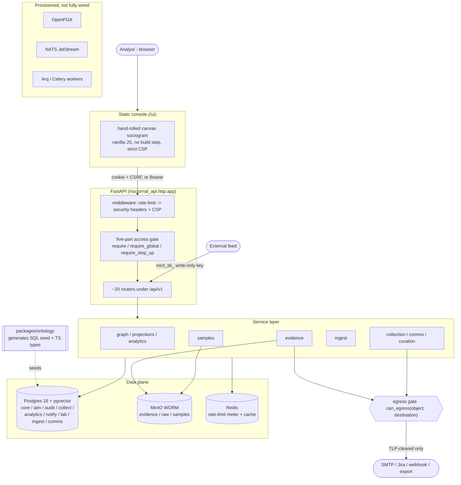

# NocTORnal — Architecture

NocTORnal is a HUMINT and social-network-analysis platform for cybercrime
investigation. Analysts build a graph of criminal actors, personas and groups
and the trust between them; every node attribute and every edge traces to
graded, custody-tracked evidence, and the machine-assisted parts of the
pipeline propose rather than decide. Comparable products: SL Crimewall,
Maltego, i2 Analyst's Notebook, UCINET (for the SNA maths), Obsidian (for the
linked-notes feel).

> **Standing.** This is a derived map, not a decision record. Where it
> disagrees with `docs/00-decisions.md` (the numbered decisions),
> `docs/16-legal-and-external.md` (the blocking legal items) or
> `docs/17-flagged-for-review.md` (what is known-wrong), THOSE are
> authoritative and this is stale. `docs/02-architecture.md` holds the
> original reasoning for the stack; this file describes what was actually
> built.

This document is the system map: the founding ideas, the twelve invariants and
how each is enforced, the ten build phases (0 through 9) and how they depend on
one another, then a layer-by-layer tour of the data model, ontology, graph and
analytics, API, security, storage, collection, UI and stack, closing with the
load-bearing decisions and the legal gates enforced in code.

> **Freshness.** This map reflects the source as surveyed on **2026-07-25** at
> **Alembic head 0052**, **1252 tests passing**. It follows the *code*, not the
> original design intent — where the two diverge (front-end stack, UUID
> version, pagination style, OpenFGA/NATS wiring) this document says so rather
> than describing the aspiration as if it were built. Companion documents:
> `docs/00-decisions.md` (the numbered decisions), `docs/09-roadmap.md` (the
> phase plan), `docs/16-legal-and-external.md` (the blocking legal items),
> `CONVENTIONS.md` (the working agreement and the twelve invariants), and
> `db/schema.sql` (the readable schema mirror).

## The three ideas everything follows from

**A handle is not a person.** `IDENTITY` (what was observed — a persona,
account, handle) and `PERSON` (who an analyst assesses them to be) are separate
node types, joined only by `ATTRIBUTED_TO`, an edge that carries a confidence
and is reversible. The entire discipline of attribution lives in that gap;
collapsing it into one record means a wrong call can never be cleanly unwound.

**Nothing is a fact.** Every attribute and every edge traces to at least one
`core.assertion` row carrying a source, an Admiralty grading, an ICD-203
confidence, a basis and two timestamps. The graph an analyst sees is a
*projection* of current, non-retracted assertions. Retract a source and the
network changes.

**Machines propose, analysts dispose.** Extractors and inference jobs write to
`collect.proposal`; they cannot write a node or edge. A human accepts a
proposal into the graph, where it is born as an inferred assertion. A graph
that invents links is worse than no graph, because it looks authoritative.

## System map

Everything an analyst reaches is same-origin: the static console under `/ui`
and the REST API under `/api/v1` are served by one FastAPI process, so there is
no CORS surface. Every case-scoped request passes the five-part gate before a
service runs. Every graph write carries an assertion. Every outbound path funnels
through one TLP egress gate.

## The twelve invariants and how each is enforced

The invariants in `CONVENTIONS.md` are not aspirations — each has an enforcement
point in code or in the database, and a test named after it. Where enforcement
is in the database it holds against any write path, including a mistaken one.

| # | Invariant | Where it is actually enforced |
|---|---|---|
| 1 | Nothing is a fact | **Database.** A symmetric pair of `DEFERRABLE INITIALLY DEFERRED` constraint triggers (migration `0022`): `node_requires_assertion` / `edge_requires_assertion` reject any element with no assertion by commit; `assertion_protects_element` rejects deleting or repointing the *last* assertion of a live element. `graph.py` `GraphWriteService` writes element + assertion in one transaction on top of it (decision 24). |
| 2 | A handle is not a person | `IDENTITY` and `PERSON` are distinct node types joined only by `ATTRIBUTED_TO`. `validate_edge_endpoints` (`0016`) blocks `SAME_AS` crossing the IDENTITY/PERSON layer; `merges.py` refuses a merge across the same boundary (decisions 1, 21). |
| 3 | Machines propose, analysts dispose | `collect.proposal` is the only extractor target; `ProposalStore` holds no `GraphWriteService` and physically cannot write the graph. `ProposalReview.accept` (permission `proposal.review`) is the sole path in, needs a human `reviewed_by`, and creates edges `is_inferred=True` with basis `AUTOMATED_INFERENCE` (decision 7). |
| 4 | Inferred edges stay distinct | `core.edge.is_inferred`; projections exclude them unless `include_inferred`; SNA metrics exclude non-`is_social_tie` edges; the UI renders inferred edges dashed. |
| 5 | History superseded, never overwritten | Retraction/supersede are row-preserving `UPDATE`s of `retracted_at` / `superseded_at`, never deletes; `retract_assertion` errors on a 0-row update. "At least one *live* assertion" is a projection property, deliberately not write-enforced, so an element can dissolve from the live graph while its rows persist for replay. |
| 6 | Audit append-only | `audit.event`: `block_mutation()` on UPDATE/DELETE/TRUNCATE + `REVOKE`, and a hash chain via `chain_hash()` under an advisory xact lock over a UTC-canonical column render (`0013`). |
| 7 | Credentials never leave the collector | `collection.py` `PersonaVault` exposes no `get_secret()` — only a `use(...)` context manager that decrypts an envelope-sealed secret, yields it to a block and drops it, auditing every use; errors are `redact()`-ed before they reach a log. |
| 8 | TLP gates egress | `egress.py` `can_egress()` / `enforce_egress()`: `NEVER_EGRESS = {AMBER_STRICT, RED}` is checked before any per-destination ceiling, one function shared by export, SMTP, Jira and webhooks, failing closed on an unknown classification or destination (decision 38). |
| 9 | Durable identifiers, not displayed ones | The ontology encodes each split as a strong/weak selector pair sharing no normalised value: `TOX_PK` (64-hex) vs `TOX_ID_FULL` (rotatable nospam), `TELEGRAM_ID` (numeric) vs `TELEGRAM_USER` (`@username`). `is_strong` gates auto-merge; a rotated-nospam regression test pins it. |
| 10 | Samples never render, never execute | `SampleService.download` refuses unless `NOCTORNAL_SAMPLE_ORIGIN` is set and the request arrived there (origin derived server-side, never a header); bytes ship `application/octet-stream` under `Content-Security-Policy: default-src 'none'; sandbox`; the object key is the SHA-256, never the filename; no sandbox combines `allow-scripts` with `allow-same-origin`. |
| 11 | Ingest keys are write-only | Keys carry the `noct_sk_` prefix and a `CHECK` forbids a `case:read` scope on `ingest.api_key`; `POST /ingest` is the only endpoint a key can reach. A leaked ingest key means junk data, never the case file. |
| 12 | Nothing silently dropped | Unparseable ingest goes to `ingest.dead_letter` with the raw fragment, `error_class` and `parser_version`; a contact-block line that cannot be resolved is stored `UNPARSED`; a failed analytics run is marked `FAILED`, never silently absent. |

---

## The phases and how they link

Sequenced in `docs/09-roadmap.md` so each phase is independently useful; the numbering runs Phase 0 through Phase 9. Status figures are the four-dimension completion weights from `ROADMAP-REMAINING.md` (model+tests 45%, HTTP API 15%, analyst UI 25%, adversarial review 15%). **As of 2026-07-26 every phase has an HTTP API, an analyst pane and an adversarial review**; Phase 6's review is the only partial one (ACH has had a pass — see docs/17 F20 — `merges.py`, `retention.py`, `approvals.py` and `break_glass.py` have not). The recurring gap is now feature work rather than reach or scrutiny.

| Phase | Name | What it delivers | Depends on | Current status |
|---|---|---|---|---|
| 0 | Foundation | Monorepo, Docker Compose, Alembic, ontology to Py/TS codegen, Argon2id+TOTP auth, one five-part access gate, hash-chained `audit.event`, CI gates | — | **complete, 100%.** Model+tests done, API done, UI done, reviewed. No typecheck by decision 42. |
| 1 | Graph core | Case CRUD, node/edge CRUD, assertion layer (`graph.py` `GraphWriteService`), selectors, evidence to MinIO WORM + custody ledger, tags, FTS | 0 (auth, gate, audit) | **complete, 100%.** All four dimensions done. |
| 2 | Sociogram | Projection presets, graph API (neighbourhood/path/subgraph/as-of), canvas sociogram, inspector, live local metrics | 1 (graph, assertion, projections) | **partial, 95%.** Model+tests done, API done, UI partial, reviewed. Gap: WebSocket push (UI polls). |
| 3 | Analytics | `analytics.py` (pure, DB-free) fed by `GraphService.project()`; centralities, Leiden, Burt, cut vertices/bridges, KPP-Neg, signed balance; runs synchronously in API (decision 30) | 2 (materialises a projection) | **partial, 85%.** Model+tests partial, API done, UI partial, reviewed. Gap: CONCOR, history charting, actor-by-forum/wallet still two-mode. |
| 4 | Collection | Adapter interface + scheduler (`due_sources`/`run_once`, no loop), RSS adapter, persona vault, document bucket, watch matching, `proposals.py` review gate | 1 (proposal to GraphWriteService; graph must work end-to-end first) | **partial, 75%.** Model+tests partial, API done, UI done (Feeds → Sources), reviewed (docs/17 F15 — ten service defects, all fixed at the service). Gap: XenForo/MyBB/Telegram adapters, embeddings, scheduler process. |
| 5 | Notification & integration | `egress.py` TLP gate (one function, fails closed), `notifications.py` centre (Alembic 0029), SMTP digest/quiet-hours, HMAC webhooks | 1 (TLP/classification); events from 6 (merge, dual-control) | **partial, 85%.** Model+tests done, API done, UI partial, reviewed 2026-07-26 (docs/17 F19 — the centre never checked case assignment, the drain checked neither assignment nor current clearance). Gap: Jira, integration admin surface, priority-1 escalation, worker. |
| 6 | Tradecraft & hardening | Entity merge with reversal (`merges.py`, 0027), dual control (decision 44, 0028), ACH (`ach.py`), report builder (`reports.py`), retention/purge, break-glass | 1 (nodes/edges, assertions); 5 (approval notifications) | **partial, 88%.** Model+tests partial, API done, UI done (merge in the inspector; Lifecycle, ACH and Report panes), **review PARTIAL** — ACH has had one (docs/17 F20: the untested hypothesis was winning), `merges`/`retention`/`approvals`/`break_glass` have not. Gap: WebAuthn, timeline replay, assumptions register. |
| 7 | Comms channels | `comms.platform` (15 seeded), contact-block parser, CLAIMED/OBSERVED/CONFIRMED bindings, PGP verification (`pgp.py`), co-participation, minimisation, 20-endpoint router | 1 (selectors, proposals); 5 (egress gate); 2 (co-participation into sociogram) | **partial, 95%.** Model+tests done, API done, UI done, reviewed (docs/17: a forged PGP verdict, a 499× tie weight, an ASCII-only label defence). Gap: Telegram id-collision model change; detached signatures. |
| 8 | Sample handling | Separate-origin download-only service (`samples.py`, 0031), encrypted-at-rest by SHA-256, quarantine to triage to RE queue, `MALWARE_ANALYST` role, static triage, REJECTED path | 0 (role, gate); 1 (case model) | **partial, 80%.** Model+tests done, API done, UI done (Lab pane), reviewed 2026-07-26 — **nine criticals**, incl. a download path with no label check and an "encrypted archive" that was a plain ZIP (docs/17 F19). Gap: imphash/ssdeep/TLSH, YARA (corpus pull started — see the YARA detection corpus section), prohibited-content screening, sandbox. **The one phase where 100% here would still mean "do not switch on" — see docs/18 L1.** |
| 9 | Ingest API | `noct_sk_` write-only keys (invariant 11 CHECK), raw-persist-before-parse, sniffed format detection, category classifier, triage scoring, simhash dedupe, dead-letter replay, stealer-log compartment | 1 (case file, selectors, dead-letter); 4 (watch/triage, proposals) | **partial, 90%.** Model+tests done, API done (202 wired), UI done (Feeds), reviewed (docs/17 F15). Gap: outbound credential vault with per-provider quota. |

### Build-order rationale

The one ordering constraint that matters (`docs/09` line 4): the graph and assertion layer must work end to end before collection is switched on. Pointing a firehose at a half-built model produces "a landfill you then have to clean by hand." So Phase 1 (assertion layer, invariant 1) and Phase 2's projection must be right before Phase 4/9 feed proposals into them — `proposals.py` accepts through `GraphWriteService`, so an accepted proposal is born as a real inferred assertion, and a defect in the model becomes a defect in every collected edge. `docs/09` line 41 goes further: stop after Phase 1 and use it on a real case for a week, because everything downstream assumes the model is correct. Analytics (3) can only materialise a graph that exists; the egress gate (5) must exist before comms (7) captures message content it can leak.

### Current state

Branch `deception-and-release-hardening`, Alembic head **0052**, **1252 tests passing, 12 skipped**, ruff clean; nothing pushed (no remote). The 12 skips are optional-dependency paths; without `DATABASE_URL` set you will instead see ~700, because half the suite is deliberately database-gated. The test count spans **two pytest roots** — `apps/api/tests` and `packages/ontology` — so run both or the figure will not reconcile.

Overall completion is **~92%**, the unweighted mean across the ten phases under the four-dimension measure. As of 2026-07-26 **every phase has a service, tests, an HTTP API, an analyst pane and an adversarial review.** UI was the single largest gap for most of this build's life and is no longer: the Lab pane (Phase 8) was the last, and what remains on that axis is WebSocket push for the sociogram and metric-history charting.

**Every review pass run on this project has found a real defect — seven for seven, four times a critical one, every time under a fully green suite.** Phase 8 is the case that should govern how the rest is read: it had 673 passing tests and shipped a security control that did not exist. Its "encrypted archive" was a plain ZIP, and its download endpoint — the one path that puts working malware on a disk — applied no label check of any kind. Both are fixed (`docs/17` F19); the lesson is that an unreviewed change is unknown, not fine. Three green tests have now turned out to be asserting the defect rather than catching it.

Completion is not lawfulness. `docs/16-legal-and-external.md` holds **four BLOCKING items** that gate any real deployment regardless of build percentage — and `docs/18-legal-review-pack.md` is the same list reorganised as a decision document, which is the one to hand a reviewer. **L1** prohibited-content policy for samples (the build refuses ingest until `NOCTORNAL_PROHIBITED_CONTENT_POLICY` and `NOCTORNAL_DESIGNATED_PERSON` are declared — a declaration it records but cannot verify; `reject()` now REFUSES to destroy bytes under a legal hold and puts the preservation-versus-destruction conflict in front of a person, rather than resolving it silently in favour of destruction); **L2** lawful basis, victim notification and real retention for stealer-log data on thousands of uninvolved people (90 days is a placeholder); **L3** authority to operate a covert persona against each target; **L4** interception law and consent for message capture. **A 92% build still must not be operated until L1–L4 are settled with counsel**, and Phase 8 is the clearest case: reviewed model, gated API, working UI, and it must not be switched on.

---

## Data model

NocTORnal's system of record is Postgres 16 with `pgvector`. The reference schema is `db/schema.sql`; the authoritative source since 2026-07-24 is the Alembic chain `db/migrations/versions/0001`–`0039` (`alembic upgrade head`), which `schema.sql` mirrors. Extensions enabled (`0001` / `schema.sql`): `pgcrypto`, `pg_trgm`, `btree_gist`, `citext`, `vector`. IDs are UUIDs generated app-side; all timestamps are `timestamptz` in UTC; weights and money are `numeric`, never float.

### Schemas

| Schema | Created | Key tables |
|---|---|---|
| `core` | `0001` | `node_type`, `edge_type`, `selector_type`, `"case"`, `node`, `selector`, `edge`, `assertion`, `hypothesis`, `hypothesis_evidence`, `evidence`, `evidence_custody`, `evidence_link`, `tag`, `tag_assignment`, `node_set`, `node_set_member` |
| `collect` | `0001` | `source`, `collection_account`, `egress_profile`, `watch`, `collection_run`, `document`, `extraction`, `proposal`, `watch_hit` |
| `iam` | `0001` | `app_user`, `webauthn_credential`, `role`, `permission`, `role_permission`, `user_role`, `case_assignment`, `break_glass`, `dual_control_request`, `session` |
| `audit` | `0001` | `event` |
| `analytics` | `0001` | `projection`, `metric_run`, `node_metric`, `community_assignment`, `layout_position` |
| `notify` | `0029` | `notification`, `delivery`, `preference` |
| `lab` | `0031` | `sample`, `sample_analysis`, `detonation`, `sample_access` |
| `ingest` | `0033` | `api_key`, `batch`, `record`, `victim_credential`, `pii_authorisation`, `dead_letter`, `category_rule` |
| `comms` | `0034` | `platform`, `channel_binding`, `device_fingerprint`, `conversation`, `participant`, `message` |

The ontology is data, not enums: `node_type`, `edge_type`, `selector_type` are reference tables keyed by `text`, so new types ship without a migration (seeded in `0017`). Genuinely fixed vocabularies are enums: `tlp`, `source_reliability` (A–F), `info_credibility` (1–6), `analytic_confidence` (LOW/MODERATE/HIGH), `assertion_basis`, `case_status`, `review_state`.

### Node / edge / assertion model

**`core.node`** carries `case_id`, `node_type` (FK `node_type.key`), a denormalised `label`, `attrs jsonb`, `classification tlp` + `compartments text[]`, world-time `valid_from`/`valid_to`/`first_seen`/`last_seen`, system-time `created_at`/`updated_at`/`deleted_at` (soft delete only), reversible-merge columns `merged_into_id`/`merged_at`/`merged_by`, a `search_tsv`, and `embedding vector(768)` (HNSW `vector_cosine_ops` index). Selector values live in `core.selector` (unique on `case_id, selector_type, norm_value`), not in `attrs`, because they are the entity-resolution join key.

**`core.edge`** is a signed, time-bounded, directed relation: `src_node_id`/`dst_node_id`, `sign smallint CHECK (sign IN (-1,0,1))`, `weight numeric(14,4)`, `valid_from`/`valid_to`, a `confidence analytic_confidence` rolled up from supporting assertions, `is_inferred boolean` + `inference_method`, and `review review_state`. `edge_type.default_sign` supplies the sign default; `is_social_tie` marks edges that count toward SNA metrics; `src_node_types`/`dst_node_types` constrain endpoints. Constraints: `edge_no_self_loop`, `edge_time_order`, and a partial unique index `edge_uniq_active` (`src, dst, edge_type, coalesce(valid_from,'-infinity')` where not deleted) that forbids parallel same-interval edges while allowing distinct intervals as history.

**`core.assertion`** is the provenance spine. Each row targets exactly one subject (`CHECK num_nonnulls(node_id, edge_id) = 1`) and carries Admiralty grading `reliability source_reliability` + `credibility info_credibility`, ICD-203 `confidence analytic_confidence`, epistemic `basis assertion_basis`, and `rationale` (mandatory for `ANALYST_INFERENCE`/`AUTOMATED_INFERENCE` via `assertion_inference_needs_rationale`). Provenance links: `source_id`, `document_id`, `evidence_id`, `external_ref`. Bitemporality uses `observed_at` (when true in the world), `recorded_at` (when asserted), `superseded_at`/`superseded_by`, and `retracted_at`/`retracted_by`/`retraction_reason` — history is superseded, never overwritten (`0007`).

### Invariant-enforcing triggers

**Invariant 1 — no graph element without an assertion (`0022`, mirrored in `schema.sql`).** A symmetric pair of `DEFERRABLE INITIALLY DEFERRED` constraint triggers: `node_requires_assertion` / `edge_requires_assertion` fire `AFTER INSERT` and reject any node/edge that has no `assertion` row by commit (deferral lets the assertion, which FKs back to the element, be written after it in the same transaction); `assertion_protects_element` fires `AFTER DELETE OR UPDATE OF node_id, edge_id` and rejects removing or repointing the *last* assertion of a still-existing element. Trigger 2 closes the `SET CONSTRAINTS ALL IMMEDIATE` timing game and the later-transaction delete. Retraction/supersede are row-preserving `UPDATE`s of `retracted_at`/`superseded_at`, so they never fire trigger 2; "at least one *live* assertion" is a projection property, deliberately not write-enforced.

**Audit append-only + hash chain (`0013`).** `audit.event` is protected by `block_mutation()` on `UPDATE`/`DELETE`/`TRUNCATE` (invariant 6). `chain_hash()` fires `BEFORE INSERT`: it takes `pg_advisory_xact_lock` to serialise chain extension, reads the prior `row_hash`, and sets `row_hash = sha256(concat_ws(chr(31), ...every payload column...))` with a UTC-canonical timestamp rendering, so a deleted or back-dated row is detectable on replay.

**Custody chain (`0023`/`0024`).** `evidence_custody` uses the same construction: `block_custody_mutation()` blocks `UPDATE`/`DELETE`/`TRUNCATE`; `custody_chain_hash()` server-pins `occurred_at := now()`, hash-chains `prev_hash`/`row_hash`, and `row_hash` is `NOT NULL` so a bypass insert with the trigger disabled is rejected. `0024` also FKs `actor_id -> iam.app_user(id)`.

**Other triggers (`0016`).** `validate_edge_endpoints` checks src/dst node types against `edge_type`, blocks `SAME_AS` crossing the IDENTITY/PERSON layer (invariant 2) and cross-case edges; `enforce_tlp_floor` (on `node`/`edge`/`evidence`) forbids a child classification below its case floor; `node_tsv`/`document_tsv`/`evidence_tsv` (`0025`) maintain search vectors. Cross-schema FKs (`core.assertion` to `collect`, `core.evidence` to `collect`, user FKs to `iam.app_user`) are added last in `0014`.

---

## Ontology: one vocabulary, generated

### The package as single source of truth

`packages/ontology/src/noctornal_ontology/definition.py` is the only editable definition of the graph vocabulary. Three frozen dataclasses — `NodeType`, `EdgeType`, `SelectorType` — hold three tuples: `NODE_TYPES` (26 rows, `category` ACTOR/ARTEFACT/CONTEXT, each with a `colour_token` and `sort_order`), `EDGE_TYPES` (49 rows, each carrying `inverse_name`, `is_directed`, `default_sign` in {-1,0,1}, `src_node_types`/`dst_node_types` endpoint whitelists, and `is_social_tie`), and `SELECTOR_TYPES` (49 rows, each with `is_strong`, `is_pii`, and a `normaliser` key). `is_social_tie=false` marks identity plumbing that SNA metrics exclude by default (invariant 4); `default_sign` distinguishes trust edges (`VOUCHED_FOR`, +1) from conflict edges (`ACCUSED_SCAM`, `RIVAL_OF`, -1).

`generate.py` emits two artefacts under `packages/ontology/generated/`: `ontology.ts` (TypeScript union types `NodeTypeKey`/`EdgeTypeKey`/`SelectorTypeKey` plus `as const` arrays for `apps/web`) and `seed_ontology.sql` (`INSERT ... ON CONFLICT (key) DO NOTHING` into `core.node_type`, `core.edge_type`, `core.selector_type`). Both files carry a DO-NOT-EDIT header. Keys are validated against `^[A-Z][A-Z0-9_]*$` before being written into unquoted Postgres `text[]` array literals, so an unsafe key fails generation loudly.

`python -m noctornal_ontology.generate --check` is the drift guard: it re-renders in memory and exits 1 if `generated/` differs (CI use). Alembic revision `0017_seed_ontology.py` seeded the initial vocabulary and also seeds IAM roles/permissions (which the generated SQL deliberately omits); `db/seed_ontology.sql` is REFERENCE ONLY since 2026-07-24. Because `ON CONFLICT DO NOTHING` keeps old rows, vocabulary changes ship as *new* Alembic revisions, never edits to 0017 — and the definition has already advanced past 0017 (e.g. edges `TX_INPUT`, `TX_OUTPUT`, `EXFILTRATED_FROM`, and stronger normalisers) which 0017 does not carry. `tests/test_db_parity.py`, gated on `DATABASE_URL`, asserts the definition equals the live `core.*` tables row-for-row.

### The normalisers

`normalisers.py` holds a registry `NORMALISERS` of 25 total, best-effort `str -> str` functions (`norm(norm(x)) == norm(x)` is tested; validation via `selector_type.validator_regex` is a separate concern). Ten are generic casing/whitespace/digit reducers (`exact`, `trim`, `lower_trim`, `upper_nospace`, `digits`, `lower_strip_at`, `upper_hex`, `lower_hex`, `upper_hex_nospace`, `lower_hex_nospace`). Fifteen are protocol-aware:

| Normaliser | Behaviour |
|---|---|
| `tox_pubkey` | truncates 76-hex Tox ID to durable first 64 hex |
| `telegram_id_norm` | strips Bot-API `-100` supergroup prefix, keeps bare-minus chat ids |
| `eip55` | `0x` + lowercase hex (mixed-case checksum is display only) |
| `punycode_lower` | IDNA2008/UTS-46 per-label punycode (avoids fass.de collisions) |
| `e164` | drops extension/separators, `00` to `+`; no national-number completion |
| `email_norm` | Gmail-only dot/`+`-tag stripping, `googlemail.com` to `gmail.com` |
| `asn_norm` | `AS`-prefix strip, asdot to asplain |
| `btc_norm` | lowercases bech32, preserves base58 case |
| `url_norm` | lowercases scheme+host, strips default port/fragment |
| `ip_norm` | stdlib canonical form, unwraps `::ffff:` IPv4-mapped |

plus `ssh_norm`, `jid_norm`, `mxid_norm`, `tlsh_norm`, `onion_norm`.

### Durable selectors and invariant 9

Invariant 9 separates *durable* identifiers from *displayed* ones. The vocabulary encodes each split as a strong/weak selector pair sharing no `norm_value`:

| Durable (`is_strong=true`) | Displayed (`is_strong=false`) |
|---|---|
| `TOX_PK` — 64-hex public key (`tox_pubkey`) | `TOX_ID_FULL` — 76-hex ID with rotatable nospam (`upper_hex`) |
| `TELEGRAM_ID` — numeric id (`telegram_id_norm`) | `TELEGRAM_USER` — recycled `@username` (`lower_strip_at`) |

`FORUM_UID` stays weak (UID 42 exists on every forum unless venue-scoped); handles are weak. `is_strong` is the auto-merge gate: per invariant 3, extractors write to `proposal`, and the sole direct-write exception is auto-merge on a strong-selector match, which still produces a reversible merge with an audit event. Strength is conservative because a false merge silently fabricates relationships between two real people — worse than a missed one. The rotated-nospam regression test (`TestToxPubkey::test_rotated_nospam_same_norm_value`) pins invariant 9.

---

## Graph writes, projections and analytics

### GraphWriteService — the only sanctioned write path

`apps/api/src/noctornal_api/graph.py` is the single ergonomic API for creating graph elements; it exists to make invariant 1 (nothing is a fact) unbreakable at the application layer, on top of the deferred-constraint triggers from migration 0022 that are the real guarantee. Every `create_*` writes the element and at least one supporting `core.assertion` row in one `self._c.transaction()`; if the assertion fails to insert — e.g. an inference basis with no rationale, rejected by `CHECK assertion_inference_needs_rationale` — the whole transaction rolls back and no orphan element survives. Connections are autocommit; each write opens one explicit transaction so element + assertion commit together and the deferred trigger validates at that commit.

`create_node(case_id, node_type, label, created_by, assertion, ...)` inserts `core.node` (attrs jsonb, `classification` default `"AMBER"`, `compartments`, `valid_from/valid_to`) then calls `_insert_assertion`. `create_edge` takes `sign: int | None`; when `None`, it reads the ontology default: `SELECT default_sign FROM core.edge_type WHERE key = %s`, raising `GraphWriteError` on an unknown edge type. It inserts `core.edge` (sign, weight, `is_inferred`, `inference_method`, confidence) plus the assertion. `AssertionInput` carries the Admiralty/ICD-203 grading (`basis`, `reliability="F"`, `credibility="6"`, `confidence="LOW"`, `rationale`, `source_id/document_id/evidence_id`, `claim_path`, `claim_value`). `add_assertion` attaches a further assertion to an existing node or edge (exactly one of `node_id`/`edge_id`) — this is how two analysts' disagreement is represented without forcing consensus. `retract_assertion` sets `retracted_at/retracted_by/retraction_reason WHERE retracted_at IS NULL`; a 0-row update raises rather than silently leaving a burned source live (invariant 5 — supersede, never delete). All `psycopg.Error` surfaces as `GraphWriteError`.

### Projections

`apps/api/src/noctornal_api/projections.py`. A metric against "the graph" is meaningless, so analysis runs against a `Projection(case_id, preset="all", include_inferred=False, min_confidence="LOW", as_of=None, edge_types=None)`; `describe()` travels with every result. `PRESETS`:

| preset | edge types |
|---|---|
| `trust` | VOUCHED_FOR, GUARANTOR_FOR, ESCROW_FOR, ACCUSED_SCAM, DISPUTED_WITH, RIVAL_OF |
| `communication` | COMMUNICATES_WITH, REPLIED_TO, MET_WITH, PARTICIPANT_IN |
| `financial` | PAID, LAUNDERED_FOR, ESCROW_FOR, CONTROLS, TX_INPUT, TX_OUTPUT |
| `all` | `None`, resolved to `et.is_social_tie` at query time; excludes SAME_AS/ALIAS_OF |

`GraphService(conn, clearance, compartments)` enforces two hard rules in SQL. First, every query filters `classification <= %s::core.tlp AND compartments <@ %s` for the caller. Second, an edge is returned only when BOTH endpoints are visible (`src_node_id = ANY(ids) AND dst_node_id = ANY(ids)` over the already-filtered node set), otherwise an edge would betray a hidden node. Inferred edges are excluded unless `include_inferred` (`%s OR NOT e.is_inferred`). Both legs also require a LIVE assertion (`EXISTS ... retracted_at IS NULL`, decision 24), so retracting the last assertion dissolves the element from the live graph while its row survives for temporal replay. `as_of` is world-time, checked against `valid_from/valid_to`. `project()` defaults `limit=2000` and sets `truncated`. `withheld()` counts elements a fully-cleared reader would see, gated by `core."case".withheld_disclosure` (`NONE`/`PRESENCE`/`COUNT`, migration 0030) without revealing which classification or where. `ego()` and `shortest_path()` run BFS (undirected) over `project(limit=5000)`. `metrics()` computes degree, weighted degree, signed positive/negative degree, local clustering, k-core, density, `dyad_count` and `evidence_coverage` in Python — the band docs/03 marks cheap enough to be synchronous under 5k nodes.

### Phase 3 analytics

`analytics.py` is database-free: every function takes a `Subgraph` from `project()` and never re-queries, so it cannot widen what the caller sees. `materialise()` collapses parallel edges to one dyad (summed strength, net sign, `contested` when a pair carries both + and -), applies trust decay at projection time (exponential half-life, `DEFAULT_HALF_LIFE_MONTHS=12`, anchored to `valid_to`/`valid_from` world-time; undated ties are not decayed and the count is reported), and builds one `igraph.Graph`. Implemented metrics: Burt `constraint` (igraph C), `effective_size`, `efficiency`, `hierarchy` (`burt`); `betweenness` (exact when node count <= `EXACT_BETWEENNESS_MAX_NODES`=3000, else Brandes pivot sampling, `DEFAULT_PIVOTS`=512, carrying `is_approximate`/`sample_size`), `harmonic_closeness`, `eigenvector` over the positive subgraph only (`centrality`); Leiden communities via `leidenalg.RBConfigurationVertexPartition` (not Louvain), components, cut vertices, bridges (`cohesion`); signed structural balance and unbalanced triads as leads, capped `TRIAD_MAX_NODES`=2000 (`balance`); and KPP-Neg key-player with Borgatti fragmentation via greedy seed + swap local search, compared against top-n betweenness (`key_player`, caps `KPP_MAX_REMOVE`=10, `KPP_MAX_NODES`=5000). `run_suite()` assembles one materialisation into ranks/percentiles, `broker_signature`, and a two-mode `mode_warning`.

### Analytics runs

`analytics_runs.py` owns Postgres. `AnalyticsRunService(conn, clearance, compartments, actor_id)` projects first, computes `graph_hash` (over caller-visible nodes/edges), upserts an `analytics.projection` row, then `_lookup` caches on `projection_id + algorithm + graph_hash + status='COMPLETE'` **and** `visibility_clearance`/`visibility_compartments` — two independent barriers so a run over RED nodes is never served to an AMBER caller. A miss inserts `analytics.metric_run` (`RUNNING`), computes, then in one transaction updates to `COMPLETE` with `result`, `is_approximate`, `sample_size` and writes per-node rows to `analytics.node_metric` (`betweenness`, `harmonic_closeness`, `eigenvector`, `constraint`, `effective_size`, `efficiency`, `hierarchy`) plus `analytics.community_assignment`; any exception marks the run `FAILED` and re-raises (invariant 12). Every outcome writes `audit.event` (`ANALYTICS_RUN`/`ANALYTICS_RUN_FAILED`, `object_type='metric_run'`). Analytics run synchronously in the API process, not a worker (decision 30): the seam is kept worker-ready, but at docs/03's under-5k-node band a queue adds process, dependency and failure mode without changing a number.

---

## API layer

### App factory and middleware

`create_app()` in `apps/api/src/noctornal_api/http/app.py` builds the `FastAPI` instance, mounts every router under `API_PREFIX = "/api/v1"`, and installs the error handlers, rate limiting and response headers. The module-level `app = create_app()` is the ASGI entry point (`uvicorn noctornal_api.http.app:app`).

Middleware registration order is deliberate and inverted from execution order (last registered runs first):

1. `install_rate_limit_middleware(app)` — the blanket ceiling, registered **first**.
2. `_headers` — an `@app.middleware("http")` registered **second**, so it is the outer wrapper.

The comment in `app.py` states the reason: a 429 refusal must still pass back out through the security headers. If the limiter were the outer layer, a refusal — the response an attacker sees most — would ship without `nosniff` or a CSP. `app.state.limiter = build_limiter()` holds the limiter per-app (not module-global) so two apps in one test process do not share meters.

`_SECURITY_HEADERS` (set via `setdefault` on every response): `X-Content-Type-Options: nosniff`, `Referrer-Policy: no-referrer`, `Content-Security-Policy: default-src 'none'; frame-ancestors 'none'`, `Cache-Control: no-store`, `Permissions-Policy: geolocation=(), camera=(), microphone=()`. HSTS is left to the TLS terminator.

Two CSPs. The API default (`default-src 'none'`) forbids everything — correct for a JSON API. For paths under `/ui`, `_headers` **overwrites** (not `setdefault`) with `_UI_CSP`: `default-src 'self'`, `script-src 'self'`, `style-src 'self'`, `img-src 'self' data:`, `connect-src 'self'`, `form-action 'none'`, `base-uri 'none'`, `frame-ancestors 'none'`, and downgrades `Cache-Control` to `no-cache`. There is deliberately **no `unsafe-inline`**: the analyst UI ships separate `.css`/`.js` so inline script stays forbidden. The UI is served from a `StaticFiles` mount at `/ui` (mounted last, so it cannot shadow an API route); `/` redirects to `/ui/`.

Docs are off by default. `docs_url`/`redoc_url`/`openapi_url` are set only when `NOCTORNAL_ENABLE_DOCS` is `1`/`true`; otherwise all three are `None`. The schema would publish the full route inventory of a law-enforcement case system, and the strict CSP blocks Swagger's CDN bundle anyway. `GET /healthz` is unauthenticated, excluded from schema, and returns no version.

### Errors: problem+json (RFC 9457)

`http/errors.py` emits `application/problem+json` with body `{type, title, status, detail?}`. `Problem` is the raised exception; `install_error_handlers` maps domain exceptions to statuses: `SelectorOwnerConflict` to 409, `CaseError`/`CurationError`/`SelectorError`/`GraphWriteError` to 400, `IntegrityError` to 409, `EvidenceError` to 400, `AccessResolutionError` to 403 (fail closed), and a catch-all `Exception` to 500 with a correlation id. `_safe_detail` never stringifies a raw DB error to a client: a wrapped `psycopg.Error` is replaced by a fixed catalogue entry keyed on constraint name (`_CONSTRAINT_MESSAGES`) or SQLSTATE (`_SQLSTATE_MESSAGES`), the raw text logged server-side against a 12-hex `ref`.

Validation errors get a dedicated `RequestValidationError` handler building `422` detail from `loc + msg` **only**. Pydantic's `input`, `ctx` and `url` keys are stripped: `input` on `/auth/login` holds the submitted password and live TOTP code (which would land in proxy/WAF/APM logs), and `url` discloses the pydantic version.

### Rate limiting

`http/limits.py` runs two layers. The **blanket middleware** applies two meters per request — `request` keyed on `credential_subject` (hashed Bearer token or `__Host-session` cookie, else IP) and `request.source` keyed on the peer IP. The credential meter only subdivides (a rotated token mints a fresh bucket), so the IP-scoped `request.source` meter is the real ceiling; both must pass. It runs before session validation (limits unauthenticated floods) and **fails open** when the backend is down, off the event loop via `run_in_threadpool` because `RedisBackend` is synchronous. `/healthz` is exempt. The **per-endpoint dependency** (`rate_limit(name)`/`rate_limit_peek(name)`) applies a smaller named limit scoped `USER`/`IP`/`CREDENTIAL`, runs after session resolution and before the gate, and **fails closed** (429 for exceeded, 503 when the meter is unmeasurable, with `Retry-After`). `X-Forwarded-For` is ignored unless `NOCTORNAL_TRUSTED_PROXY_HOPS` is set, then counted from the right. Backend selection reads `NOCTORNAL_RATELIMIT` (off switch) and `REDIS_URL`.

Authorization is not in these files but is invoked from every router via `require(perm)` (case-scoped five-part gate, case id from the path), `require_global(perm)` (no case), and `require_step_up` (fresh MFA), all in `http/deps.py`.

### Routers

All prefixes below are relative to `/api/v1`.

| Router file | Prefix | Responsibility | Notable endpoints | Governing permission(s) |
|---|---|---|---|---|
| `auth.py` | `/auth` | Password+TOTP login, logout, whoami, recovery codes | `POST /login`, `POST /logout`, `GET /me`, `POST /recovery-codes` | session-only; login metered `auth.login`/`auth.login_failed`; recovery codes step-up |
| `cases.py` | (none) | Case create/list/read/transition | `POST /cases`, `GET /cases/{id}`, `POST /cases/{id}/status` | `case.create` (global), `case.read`, `case.update` |
| `graph.py` | `/cases/{case_id}` | Node/edge/assertion writes, retraction | `POST /nodes`, `POST /edges`, `POST .../assertions`, `POST /assertions/{id}/retract` | `graph.node.create`, `graph.edge.create`, `assertion.create`, `assertion.retract` |
| `graphview.py` | `/cases/{case_id}/graph` | Projections, ego, path, metrics, saved layout | `GET ""`, `GET /ego/{id}`, `GET /path`, `GET /metrics`, `GET`/`PUT /layout` | `case.read`; `/metrics` `analytics.run`; `PUT /layout` `graph.node.update` |
| `evidence.py` | `/cases/{case_id}/evidence` | WORM upload, download, verify, custody, links | `POST ""`, `GET /{id}/content`, `POST /{id}/export`, `GET /{id}/custody` | `evidence.upload`, `evidence.read`, `evidence.export` (step-up) |
| `search.py` | `/cases/{case_id}` | Node/evidence search, selector lookup | `GET /search/nodes`, `GET /search/evidence`, `GET`/`POST /selectors` | `case.read`, `evidence.read`, `graph.node.update` |
| `read.py` | `/cases/{case_id}` | Graph read, provenance, evidence list, ontology | `GET /nodes`, `GET /nodes/{id}/assertions`, `GET /edges`, `GET /ontology` | `case.read`, `evidence.read` |
| `analytics.py` | `/cases/{case_id}/analytics` | SNA suite, key player, metric history | `GET ""`, `GET /key-player`, `GET /history/{node}` | `analytics.run` |
| `proposals.py` | `/cases/{case_id}/proposals` | Capture, triage queue, disposition | `POST /capture`, `GET ""`, `POST /{id}/accept`/`reject`/`defer` | `evidence.upload` (capture), `case.read` (queue), `proposal.review` |
| `merges.py` | `/cases/{case_id}/merges` | Entity merge + reversal, dual control | `POST ""`, `POST /{id}/reverse`, `GET ""` | `graph.merge`+step-up, `graph.unmerge`+step-up, `case.read` |
| `approvals.py` | `/cases/{case_id}/approvals` | Four-eyes request/decide/withdraw | `POST ""`, `POST /{id}/decide`, `POST /{id}/withdraw` | `case.read` + operation's own permission; decide is step-up |
| `approvals.py` (`policy_router`) | `/cases/{case_id}/policy` | Per-case dual-control & disclosure policy | `GET ""`, `PUT ""` | `case.read`, `case.update`+step-up |
| `notifications.py` | `/notifications` | Inbox, read/ack, preferences, outbox drain | `GET ""`, `POST /{id}/read`, `PUT /preferences/{ch}`, `POST /dispatch` | session-only; `/dispatch` `integration.manage` (global, step-up) |
| `samples.py` | `/samples` | Sample submit/queue/detail, download, analysis | `POST ""`, `GET /{id}`, `POST /{id}/download`, `POST /{id}/detonation` | `sample.submit`/`read`/`analyse`/`download`(step-up)/`detonate`(step-up) (all global) |
| `ach.py` | `/cases/{case_id}/ach` | ACH matrix, hypotheses, stances | `GET ""`, `POST /hypotheses`, `PUT /hypotheses/{id}/stance` | `report.generate` |
| `reports.py` | `/cases/{case_id}/report` | Build (redacted) and release (egress-gated) | `POST ""`, `POST /release` | `report.generate`, `report.export` (step-up) |
| `comms.py` | `/cases/{case_id}/comms` | Bindings, PGP verify, contact blocks, conversations, co-participation | `POST /bindings`, `POST /pgp/verify`, `POST /conversations`, `GET /co-participation` | `comms.bind`, `comms.read`, `comms.stoplist.manage`, `comms.minimise` (step-up) |
| `comms.py` (`global_router`) | `/comms` | Platform reference data, global stoplist | `GET /platforms`, `POST /stoplist`, `POST /stoplist/{id}/retire` | session-only; stoplist `comms.stoplist.manage` (global) |
| `governance.py` | `/retention` | Retention rules, due preview, purge, tombstones, legal hold | `GET /rules`, `POST /purge`, `POST /purge/out-of-schedule`, `POST /legal-hold` | `retention.read`/`manage`/`purge` (global, purge step-up); case checked via `_case_scoped` |
| `governance.py` (`break_glass_router`) | `/break-glass` | Emergency access invoke/review/revoke | `POST ""`, `GET /unreviewed`, `POST /{id}/review`, `GET /mine` | `break_glass.invoke`, `break_glass.review` (global); `/mine` session-only |
| `collection.py` | `/collection` | Source polling, persona health, egress separation | `GET /sources/due`, `POST /sources/{id}/run`, `GET /personas` | `collection.read`/`run`/`collection_account.manage` (all global) |
| `ingest.py` | `/ingest` | Key-authed batch submit, key mgmt, parse, dead-letters, victim PII | `POST ""` (202), `POST /keys`, `POST /batches/{id}/parse`, `POST /credentials/{id}/reveal` | ingest API key (`POST ""`); else `ingest.manage`/`read`/`replay`, `victim_pii.authorise`/`reveal` (step-up) |

`POST /ingest` is the only endpoint authenticated by an `ingest.api_key` (write-only, invariant 11) rather than a session; it returns 202 and a batch id and reaches nothing else.

---

## Security architecture

### The five-part access gate

Every case-scoped decision funnels through one pure function, `evaluate(ctx: AccessContext) -> Decision` in `apps/api/src/noctornal_api/security/access.py`. It runs five checks with **no short-circuit** (so `Decision.failed_checks` names every reason a request failed) and allows the request iff all five pass:

| # | Constant | Predicate |
|---|----------|-----------|
| 1 RBAC verb | `role_grants_permission` | `ctx.permission_key in ctx.role_permissions` |
| 2 Assignment | `case_assignment_unexpired` | `ctx.has_unexpired_assignment` |
| 3 TLP clearance | `tlp_clearance_dominates` | `ctx.user_clearance >= ctx.object_classification` |
| 4 Compartments | `compartments_subset` | `ctx.object_compartments <= ctx.user_compartments` |
| 5 Step-up MFA | `step_up_freshness` | if `permission_requires_step_up`, `now - mfa_satisfied_at < STEP_UP_FRESHNESS` |

TLP is an ordered `IntEnum` lattice (`CLEAR=0 ... RED=4`) whose order must match the SQL enum. The verb and relationship checks are independently necessary: the role is read from the assignment **even when expired**, so an expired analyst keeps the verb but loses the row. Any unresolvable input (unknown permission/user, out-of-range TLP) raises `AccessResolutionError`, which the HTTP layer treats as a hard 403 — resolution fails closed, never 500.

The `AccessContext` is built by `PgAccessResolver.resolve()` in `apps/api/src/noctornal_api/stores.py`, which reads `iam.permission.requires_step_up`, `iam.app_user (tlp_clearance, compartments)`, `iam.case_assignment (role_key, expires_at > now())`, and `iam.role_permission`. All queries parameterised; every lookup fails closed.

The gate wires into requests through `apps/api/src/noctornal_api/http/deps.py`. `require(permission_key)` gates case-scoped endpoints (case id from the path); `require_global(permission_key)` gates non-case endpoints (e.g. `case.create`) via `iam.user_role`, checking `is_active` and step-up when the permission demands it; `require_step_up` demands fresh MFA independently of any permission (used for merges per docs/01). `authorize_object` computes `effective_labels` — the **stricter** classification (`max`) of case and element and the **union** of their compartments — before resolving and evaluating, so an element can never be less protected than its case. On denial it audits `AUTHZ_DENIED`; a `case_assignment_unexpired` failure returns 404 (not 403) so status codes are not an existence oracle. `check_writable_labels`/`user_ceiling` refuse authoring content above the caller's own clearance/compartments. CSRF is double-submit: cookie-derived credentials (`__Host-session`) on unsafe methods require an `x-csrf-token` header matching the `__Host-csrf` cookie; Bearer tokens are immune.

### Authentication primitives

- **Passwords** (`passwords.py`): Argon2id, `time_cost=3`, `memory_cost=64*1024` (64 MiB), `parallelism=4`, `Type.ID`. `needs_rehash` allows opportunistic upgrade. Recovery codes reuse the same KDF.
- **Auth service** (`auth.py`): single-step — password **and** TOTP submitted together, returning only `OK` or `INVALID_CREDENTIALS`; the specific reason lives in `audit_reason` (server-side only) to avoid a password/enumeration oracle. Constant work: every attempt runs one Argon2id verify (real hash or fixed `_DUMMY_HASH`) before any state branch. `MAX_FAILED_LOGINS=5`, `LOCKOUT_DURATION=15 min`; a correct-password/no-code probe still burns a lockout attempt. Recovery codes (`recovery.py`: 10 single-use, regenerated as a set, plaintext shown once) are told apart by shape and consumed atomically.
- **TOTP** (`totp.py`): RFC 6238, `STEP_SECONDS=30`, `DIGITS=6`, `DRIFT_WINDOWS=1` (plus/minus 1 step), SHA-1 for authenticator compatibility, at least a 160-bit base32 secret. Replay protection: a candidate step counter is accepted only if **strictly greater** than the stored `last_counter`; on success the caller persists `new_last_counter` via the store's atomic compare-and-set (`advance_totp_counter`), so a concurrent login consuming the same code fails.
- **Sessions** (`sessions.py`): opaque, server-side, stored in `iam.session`. `ABSOLUTE_LIFETIME=12 h`, `IDLE_TIMEOUT=30 min`, `STEP_UP_FRESHNESS=15 min`, all enforced server-side in `validate()`. Single-session `revoke` (logout) and `revoke_all_for_user` (global, for password change/admin kill).
- **Tokens** (`tokens.py`): 256-bit `secrets.token_urlsafe(32)`; only the SHA-256 hash is stored (`iam.session.token_hash`); raw token returned once.
- **Envelope** (`envelope.py`): AES-256-GCM over TOTP secrets, blob = `nonce(12) || ciphertext`, `key_id="env:v1"`. KEK sourced from **`NOCTORNAL_TOTP_KEK`** (base64, 32 bytes); it refuses to encrypt/decrypt with a default key.

### Egress and credential invariants

| Invariant | Enforced in |
|-----------|-------------|
| 8 — TLP gates egress | `apps/api/src/noctornal_api/egress.py`: `can_egress()`/`enforce_egress()`. `NEVER_EGRESS = {AMBER_STRICT, RED}` checked before any per-destination ceiling; compartmented material never crosses; unknown classification/destination fails closed. Destinations: `IN_APP, EXPORT, SMTP, JIRA, WEBHOOK`. |
| 7 — credentials never leave the collector | `apps/api/src/noctornal_api/collection.py`: `collection_account.secret_*` is decrypted (`envelope.decrypt`) only inside the collection worker; no function returns a plaintext credential to the API process. |
| 6 — audit append-only | `db/schema.sql`: trigger `event_append_only` (BEFORE UPDATE OR DELETE) + `event_no_truncate` calling `audit.block_mutation()`; `REVOKE UPDATE, DELETE, TRUNCATE ON audit.event FROM PUBLIC`; hash chain via `audit.chain_hash()` trigger `audit_chain`. Evidence custody has the parallel `evidence_custody_append_only`. |
| 11 — ingest keys write-only | `CONSTRAINT api_key_no_read_scope CHECK (NOT ('case:read' = ANY(scopes)))`, default `scopes = '{ingest:write}'`. (As surveyed, this constraint lives in `db/concept/schema_concept.sql`; the ingest router enforces the write-only key model in code today.) |

---

## Evidence, samples and ingest

Three storage domains, three MinIO buckets, three Postgres schemas: `core.evidence`, `lab.sample`, `ingest.*`. They do not share credentials or blast radius.

### Evidence (`apps/api/src/noctornal_api/evidence.py`)

Exhibits land in a MinIO bucket (`EVIDENCE_BUCKET`, default `noctornal-evidence`; config from `MINIO_ENDPOINT` / `MINIO_ACCESS_KEY` / `MINIO_SECRET_KEY` / `MINIO_SECURE`) under object-lock retention. `EvidenceStorage.put` sets `Retention(COMPLIANCE, retain_until)` — **COMPLIANCE, not GOVERNANCE**: GOVERNANCE is bypassable by any principal holding `BypassGovernanceRetention`, so it would not hold WORM against the API's own credentials; COMPLIANCE blocks delete/overwrite before `retain_until` even for root. Retention defaults to `EVIDENCE_RETENTION_DAYS` (365) from ingest time.

Every exhibit is dual-hashed at ingest: SHA-256 (`hashlib`) and BLAKE3 (`blake3`), stored in `core.evidence.sha256` / `.blake3`. The object key is `{case_id}/{sha256hex}`; dedup is `UNIQUE(case_id, sha256)`. After `put`, `ingest()` **reads the object back and re-hashes** before committing the row, catching a store-side short-write (`IntegrityError`). On **every** read — `view()` and `export()` both route through `_fetch_verified` — the fetched bytes are re-hashed against `core.evidence.sha256` and the path **fails closed** (`IntegrityError`) on mismatch, writing a failed `HASH_VERIFIED` custody entry and an `EVIDENCE_INTEGRITY_ALARM` audit event rather than serving the bytes. `verify_integrity()` additionally checks BLAKE3 as a second independent anchor.

Custody is an append-only ledger: `_custody` inserts into `core.evidence_custody` (`action` in ACQUIRED / VIEWED / EXPORTED / HASH_VERIFIED, `actor_id`, `occurred_at`, `hash_verified`), and every touch also writes a hash-chained `audit.event` (`object_type='evidence'`). No `UPDATE`/`DELETE` path exists on either.

`export()` is the only egress. It calls `noctornal_api.egress.can_egress` — the single TLP gate shared by SMTP/Jira/webhooks (invariant 8, Phase 5) — passing `classification` and `compartments`; a denial writes `EVIDENCE_EGRESS_REFUSED` and raises. The old local frozenset is retained only as `_NO_EGRESS`, derived from `egress.NEVER_EGRESS` so it cannot drift. Bytes are re-verified before release.

### Samples (`samples.py`, `http/routers/samples.py`, Phase 8)

Invariant 10 is enforced at runtime, not documented. `SampleService.download` refuses unless `NOCTORNAL_SAMPLE_ORIGIN` is configured **and** the request arrived there — `request_origin` is taken from `request.url.scheme://netloc` server-side, never a client header. The `POST /samples/{id}/download` route (the only endpoint touching bytes; `sample.download` + `require_step_up`) returns `application/octet-stream`, `Content-Disposition: attachment; filename="{sha256}.zip"`, `X-Content-Type-Options: nosniff`, and `Content-Security-Policy: default-src 'none'; sandbox`. Metadata endpoints render freely (hashes, `file_type`, `entropy`, `triage_gaps`, analyses, custody); sample bytes never render and no sandbox combines `allow-scripts` with `allow-same-origin` (invariant 10). The object key is the SHA-256 (`samples/{hh}/{sha256}`), never the attacker-controlled filename. Bytes are encrypted at rest under a per-sample key (envelope-wrapped via `security.envelope`); the current `_xor_stream` keystream is labelled containment, not confidentiality — its jobs are stopping EDR from quarantining evidence and ensuring nothing on disk is runnable. Every download re-hashes and fails closed on SHA-256 mismatch. `archive()` wraps as a ZIP with public password `infected` (interlock against double-click execution, no confidentiality).

**The policy gate.** `SampleService.submit` calls `policy_declared()`, which requires both `NOCTORNAL_PROHIBITED_CONTENT_POLICY` (an auditor-followable reference, not a boolean) and `NOCTORNAL_DESIGNATED_PERSON`. Absent either, submit raises `PolicyNotDeclared` and the router returns **HTTP 451** — the refusal is legal, not technical. `GET /samples/policy` surfaces the state and a counsel-review notice. Samples land in `QUARANTINED`; triage is static-only (magic-byte typing, entropy, MD5/SHA-1/SHA-256) with absent steps recorded as `triage_gaps` rather than silent NULLs.

Stealer logs are segregated from evidence: they live in the `ingest` schema, never `core.evidence` (decision 19). The malware store is `lab.sample` in its own bucket (`SAMPLE_BUCKET`, default `noctornal-samples`; `SAMPLE_ENDPOINT` / `SAMPLE_ACCESS_KEY` / `SAMPLE_SECRET_KEY`, falling back to the MINIO_* vars only for a single-node dev stack).

### YARA detection corpus (in progress)

The static-triage side of Phase 8 is backed by a provenance-tracked YARA corpus
pulled from public sources, laid out under `yara/` and driven by
`scripts/yara_db.py` (`fetch` / `build` / `stats`). It is built to the same
rules as the rest of the system, not as a loose dump of signatures:

- **Not bundled.** The manifest `yara/sources.json` lists each upstream repo
  with its licence; the tool clones them (shallow) into a **gitignored**
  `yara/vendor/` tree and compiles them into `yara/dist/`. The rules are a
  fetched build artifact, never committed — a prosecution-grade tool must not
  silently inherit the licence of every third-party rule, and several sources
  (`signature-base`, `elastic-protections`) carry non-permissive terms flagged
  `"review": true` for counsel to clear before any redistribution.
- **Provenance.** `yara/fetch.lock.json` records the exact commit of each source
  pulled and when — reproducible and auditable in a disclosure context, the same
  discipline `core.assertion` applies to graph elements.
- **Nothing dropped (invariant 12).** `build` compiles each file with
  `yara-python` when present and routes non-compiling files to
  `yara/dist/dead_letter.json` with the reason; rule-name collisions across
  sources go to `yara/dist/collisions.json` rather than a silent
  last-writer-wins merge.
- **Rules only, off the cloud.** `fetch` prunes every non-`.yar`/`.yara` file
  after each clone, and threat-intel/IOC repos that ship live samples are
  excluded from the manifest — a lesson from a pulled IOC dump
  (`StrangerealIntel/DailyIOC`) that carried live FIN7 and Babuk samples the
  workstation AV quarantined mid-clone. `NOCTORNAL_YARA_HOME` relocates the
  corpus outside a cloud-synced or AV-watched tree.

**Status: scaffolding and a fetch-on-demand, rules-only pipeline; not yet wired
into `samples.py`.** Two invariants govern that wiring when it happens: a YARA match
is static pattern-matching over bytes in the sample store and must never cause a
sample to render or execute (**invariant 10**), and a match is graded evidence
attributed to its rule and source — written as a proposal/assertion for an
analyst, **never as a fact** (invariant 1). Remaining: namespaced multi-file
compilation (per-file compile currently sends cross-referencing rules to the
dead-letter), external-module coverage, and a scan endpoint that records hits as
gradeable assertions.

### Ingest (`ingest.py`, `http/routers/ingest.py`, Phase 9)

Ingest keys are write-only (invariant 11). They carry the `noct_sk_` prefix (`KEY_PREFIX = "noct_sk"`, format `noct_sk_{live|test}_{key_id}{secret}`), split so the public half is indexed and the secret half HMAC-compared constant-time. A `case:read` scope on `ingest.api_key` is a bug backed by a CHECK constraint (per the router docstring). `POST /ingest` is the only endpoint a key can reach — it authenticates via `Authorization: Bearer`, `accept()` persists raw bytes to `ingest.batch` and returns **202 before any parsing** (raw-before-parse, so a wrong parser is replayable). Everything else on the router is session-authenticated (`ingest.manage` / `ingest.read` / `ingest.replay`).

Parsing (`parse_batch`) splits the raw into fragments; anything that will not parse — or fails `_store_record` — is written to `ingest.dead_letter` with the raw fragment, `error_class`, `error_detail` and `parser_version` (invariant 12, nothing silently dropped). `replay()` re-parses a repaired fragment without overwriting the original. Keys are HMAC'd with `NOCTORNAL_INGEST_PEPPER` (`hash_secret`), deliberately separate from the TOTP KEK; the same pepper fingerprints victim credentials (`ingest.victim_credential`) so correlation via `search_by_fingerprint` works without any readable value column. Stealer-log feeds require a `forced_compartment` (enforced in code and by CHECK); reveals need a live `ingest.pii_authorisation` (`victim_pii.reveal` + step-up) or return 451.

---

## Social-engineering evidence: phishing, BEC, vishing

`docs/19`. Schema `deception`, migrations 0046–0050, service
`deception.py`, router `http/routers/deception.py`, pane `DECEPTION`.

The design premise: each of the three claims an analyst needs to make is a
**tuple**, and the model had nowhere to put the tuple. A screenshot alone
proves somebody had a screenshot; a `From:` header alone proves nothing at
all. So `deception.capture` holds requested URL, redirect chain, final
URL, TLS identity, screenshot, DOM and HAR **on one row** — the pairing is
the evidential value, and a schema that stored them as independent
exhibits would invite a screenshot to be re-paired with another page's DOM.

### Invariant 10 generalised — a captured page is attacker-authored code

`core.evidence.is_hostile_markup` (0046) marks bytes that may be
downloaded and never rendered by the API origin: DOM, HAR, `.eml`, SVG.
`EvidenceService.ingest` derives it from a media-type allowlist at the one
place bytes enter, so a caller cannot forget it.

`/captures/{id}/screenshot` is the **first and only inline-rendering
exhibit path in the product** — every other route serves
`application/octet-stream` as an attachment. Five guards, all
load-bearing: the five-part gate against composed labels; the evidence id
is read from the capture row so a caller cannot name one; `is_hostile_markup`
refuses outright; the content type is **re-derived from the magic bytes**
(`raster_type_of`) because `media_type` is `UploadFile.content_type` and
therefore client-supplied; and `CSP: default-src 'none'; sandbox` plus
`nosniff` and `Cross-Origin-Resource-Policy: same-origin`. WebP and AVIF
are deliberately absent from the allowlist.

### Invariant 9 generalised — the displayed identifier is the spoofed one

In this domain the displayed identifier is chosen by the attacker *as* the
attack. `deception.call_record` therefore has `presented_number` /
`presented_name` **and** `originating_trunk` / `p_asserted_identity` /
`stir_shaken_attestation` as separate columns, and
`selector_candidates_for_call()` — the one function that decides what
becomes a selector — returns nothing derived from a presented value. A
verified attestation A promotes the presented number only to *weak*.
`stir_shaken_verified` is separate from the letter, because an unverified
claim of attestation A is worth nothing and one boolean would have let it
read as verified.

### The Received chain is trustworthy inwards only

`deception.email_hop.seq` is numbered **recipient-first** (0 = the
receiving organisation's own MTA) and `is_trusted_boundary` marks where
trust stops. Trust follows the **`by`** host — the MTA that WROTE the
header — so the boundary hop's `from_ip` is our own infrastructure's
observation of who connected, and is the most valuable identifier in the
message; everything above it is attacker-writable. `NOCTORNAL_TRUSTED_MTA_HOSTS`
configures it, and an unset value means only hop 0 is trusted, which is the
only defensible default. A partial unique index enforces at most one
boundary per message, because two would make the question unanswerable.

`email_message` stores parsed headers as columns that are **allowed to
disagree** (`header_from`, `header_from_display`, `header_reply_to`,
`header_return_path`, `envelope_from`) plus what the receiving MTA
decided. `from_replyto_divergent` is stored rather than computed on read,
because it is the finding and a historical report must not change when the
parser improves. A DKIM domain is recorded **only when DKIM passed** —
`email_dkim_domain_needs_pass` is a CHECK, because `header.d=` on a failing
signature is a claim by the attacker.

### Ontology and legal

Two additions: `LURE` (the pretext, distinct from the `TOOL` that
generates it) and `IMPERSONATES` — a FALSE identity claim, where
`ALIAS_OF`/`SAME_AS` assert the subjects *are* the same. `IMPERSONATES` is
`is_social_tie = false`, `default_sign = 0`, and that is the point: as an
affiliation it would make the impersonated brand the highest-betweenness
node in every phishing case in the system. `TARGETED` is widened rather
than duplicated. Four selectors: `TLS_SPKI` (strong — survives the domain
rotation phishing infrastructure does constantly), `SIP_URI` (strong),
`EMAIL_MSGID` and `FAVICON_MMH3` (both weak, pivots not identities).

**Legal item L5** is new and blocking: entering input into a phishing
page, including canary credentials, may constitute unauthorised access.
`capture_submission_needs_authority` is a CHECK; there is no code in this
platform that submits anything. `capture_active_needs_egress_profile` is
an **attestation, not a routing control** — nothing here performs the
fetch, and `collect.egress_profile.endpoint_ciphertext` is read by zero
lines of Python. Stated plainly because a constraint that looks like a
technical control while being an attestation is this codebase's recurring
defect shape.

Deliberately not built: live SIP interception, credential-submission
automation, a mailbox connector, URL detonation from the UI, and any
"is this phishing?" classifier.

## Collection, comms and curation

### Collection layer (Phase 4)

`collection.py` implements the adapter/persona/scheduler engine over the `collect.*` schema. Invariant 7 (credentials never leave the collector) is enforced by shape, not discipline: `PersonaVault` exposes no `get_secret()` — only `use(persona_id, *, actor_id, purpose)`, a context manager that decrypts `collect.collection_account.secret_ciphertext` via `security/envelope.decrypt(..., key_id=secret_key_id)`, yields the plaintext to a block, and drops it. Every use writes an `audit.event` (`PERSONA_USED` with a purpose). `store()` re-encrypts with `envelope.encrypt` and stamps `secret_rotated_at`. `redact()` masks credential-shaped substrings (structural regex over `password|token|api_key|...` and `user:pass@` URLs) and is applied to every adapter error before it reaches `collect.collection_run.error_detail`.

Persona lifecycle: `HEALTHY/COOLDOWN/LOCKED/BURNED`; `BURNED` is terminal and `set_status` requires a `burn_reason`. `check_egress_separation(source_id)` reports two live personas sharing an `egress_profile_id` against one source (a temporal condition, deliberately not a DB constraint).

The `Adapter` interface returns `Item`s, never graph elements — only `RssAdapter` (key `rss`) exists; XenForo/MyBB/Telegram are stubs pending authorisation (docs/16 L3). `parse_rss` refuses any feed containing a `DOCTYPE`/`ENTITY` (XXE floor). `CollectionService.run_once` rate-limits (`RateLimiter`), fetches, writes deduped/versioned `collect.document` rows (content_sha256, `supersedes_id`), and matches `collect.watch` keywords/selectors/regexes into `collect.watch_hit` with suppression. `due_sources()` reports; nothing loops (`next_due_at` adds symmetric percentage jitter). `fetch()` blocks non-HTTP schemes and private-range resolution (SSRF floor; DNS-rebinding unaddressed). Router `/collection` gates on `collection.read`, `collection.run`, `collection_account.manage`.

### Comms (Phase 7)

`comms.py`, `contact_blocks.py`, `pgp.py`, `coparticipation.py` over the `comms.*` schema. `comms.normalise(platform_key, observed)` reduces an identifier to its durable part, delegating canonical form to `noctornal_ontology.normalise` (the single source of truth — a second normaliser is called "a correlation bug with a delay fuse"). Durable-selector traps: Tox to first 64 hex (nospam/checksum dropped); Telegram to numeric id, never `@username` (with a known unresolved `-100` channel/user collision, docs/16 D8); SimpleX to `None` with a coverage note; Signal/Wire to account UUID not phone/handle; Matrix to server part folded, localpart preserved. `CommsService.bind` writes `comms.channel_binding` at verification `CLAIMED/OBSERVED/CONFIRMED`; `correlate`/`co_declared`/`shared_devices`/`contact_graph` filter on the caller's own `classification`/`compartments`, not the case's.

`contact_blocks.parse` (pure) resolves each line by label (`_LABEL_ALIASES`), by unambiguous shape, or leaves it `UNPARSED` (invariant 12). Four escrow-error defences: third-party labels (incl. Cyrillic escrow-agent terms), in-line disclaimers, the `comms.service_selector` stoplist (global by default), and shared-service detection over distinct publishers (`SHARED_SERVICE_THRESHOLD = 3`). `parse_and_store` writes `comms.contact_block`/`contact_block_entry` and raises `collect.proposal` rows only — no `channel_binding`, `node` or `edge` (invariant 3); `block_fingerprint` (SELF selectors, computed after stoplist passes) detects copied blocks.

`pgp.verify_clearsigned` delegates to the `gpg` binary (env `NOCTORNAL_GPG`), parsing only `--status-fd` bytes split on `b"\n"` (`_status_lines` — the defence against a crafted-user-ID `VALIDSIG` forgery that `str.splitlines()` enabled). It checks the claimed fingerprint (trap 1) against gpg's `--output` of the signed region (trap 2), token-boundary-matches the value, and records every outcome in `comms.pgp_verification`; only `VERIFIED` upgrades a binding to `CONFIRMED`. `NO_VERIFIER` keeps it `CLAIMED`. `coparticipation.py` projects `comms.conversation x comms.participant` to one mode with Newman weighting over raw room size, excluding oversized/incidental/unresolved rooms (all reported), marked `is_inferred`.

### Curation — machines propose, analysts dispose (invariant 3)

`proposals.py`: `ProposalStore.propose` (kinds `NODE/EDGE/ATTRIBUTE`) is the only extractor path; it holds no `GraphWriteService` so it physically cannot touch `core.node`/`core.edge`. `ProposalReview.accept` (permission `proposal.review`) is the sole path into the graph, requires a human `reviewed_by`, writes through `GraphWriteService` with basis `AUTOMATED_INFERENCE`, and creates edges as `is_inferred=True` (invariant 4). States: `PROPOSED/ACCEPTED/REJECTED/DISPUTED`.

Note: the invariant-3 "auto-merge on an `is_strong` selector match" is **not** implemented as automatic. In `selectors.py`, a strong selector already attributed to another node raises `StrongSelectorConflict` — a merge *lead* — and `merges.py` merges are human-initiated. `MergeService.merge` records `core.node_merge` + `core.node_merge_edge` (endpoints saved before repointing), refuses the IDENTITY/PERSON boundary (invariant 2), audits `NODE_MERGED`, and fires `notify_events.merge_performed`; `unmerge` restores exactly.

Supporting modules: `approvals.py` (four-eyes; `OPERATIONS` catalogue, payload-hash binding, `consume` one-shot; constraint in migration 0028); `notifications.py` (`notify.notification`/`delivery`/`preference`, four suppressions, current-clearance read filter); `ach.py` (Heuer matrix ranked by weighted inconsistency, pure); `reports.py` (`ReportBuilder` builds at a target-TLP projection, structural redaction, evidence SHA-256/BLAKE3 register, `check_egress`). Routers gate on `graph.merge`/`graph.unmerge`, `report.generate`/`report.export`, and `comms.bind`/`comms.read`/`comms.minimise`/`comms.stoplist.manage`.

---

## Analyst UI

### Stack

The analyst console is served from `apps/api/src/noctornal_api/http/static/` — four files, no build step, no bundler, no CDN: `index.html`, `app.css`, `app.js` (~4,510 lines) and `layout-worker.js` (~274 lines). `apps/api/src/noctornal_api/http/app.py` mounts it same-origin as `StaticFiles(directory=STATIC_DIR, html=True)` under `/ui` (`/` redirects to `/ui/`). A per-path CSP (`_UI_CSP` in `app.py`) sets `default-src 'self'; script-src 'self'; style-src 'self'; img-src 'self' data:; connect-src 'self'; base-uri 'none'; form-action 'none'` — deliberately **no `unsafe-inline`**. The separate `.css`/`.js` files exist precisely so inline script stays forbidden; node-type hues are carried by CSS classes (`.hue-actor-persona`...) rather than inline styles for the same reason (`app.css`).

This diverges from the `docs/02-architecture.md` plan. That document specifies Next.js 15 / TypeScript / Tailwind for the front end and `graphology` + `sigma.js` (WebGL) for the sociogram. None of that is present. The sociogram is a hand-rolled 2D `<canvas>` renderer (`#graph-canvas`) with a main-thread spring/repulsion simulation (`step()`, exact O(n^2) below 320 nodes, a uniform-grid approximation above) and an off-main-thread ForceAtlas2 Barnes-Hut layout in `layout-worker.js`. Plain vanilla JS throughout; state lives in one `state` object.

### Features

- **Four projection presets** from `GET /graph/presets` (server `projections.py PRESETS`): Trust, Communication, Financial, All ties. Alongside: min-confidence (`LOW/MODERATE/HIGH`), include-inferred, "mark unevidenced", and a node-size metric (`degree`, `weighted_degree`, `k_core`, `clustering`) from `/graph/metrics`.
- **Ego focus** — double-click or Enter fetches `/graph/ego/{id}?depth=...`; a `focus-flag` states the mode and offers Esc to leave.
- **Shortest-path highlight** — shift-click two nodes calls `/graph/path` (undirected, no `as_of`); a non-connected pair is reported as a finding.
- **Timeline scrubber** over `as_of` (`#tl-range`) with a density strip (`#tl-density`) showing collection volume; refetches are sequence-guarded so the newest drag wins; "as-of: now" resets.
- **Hover dimming** (`hoverId`) and **hide-inferred** on held Space (`hideInferredHold`).
- **Metrics/analysis panel** (Phase 3, `#pane-analytics`): brokerage (betweenness, Burt's constraint, effective size), communities, key-player removal set, cohesion, signed balance, optional trust-decay half-life — always restating the projection parameters.
- **Saved layout with pinning** — positions in world coordinates, PUT back to the server, pin/clear-pins, survive window resize.
- **Command palette** (`Ctrl/Cmd-K`, `#palette`): jump to an entity or case, switch projection, change size metric, save/clear/re-layout, reset as-of, ego of the selection. Nothing it does the on-screen controls cannot.
- **Inspector** answers "why do we believe this": each assertion shows the Admiralty grading badge (reliability A–F + credibility 1–6, expanded on hover), the ICD-203 confidence word with its opacity value, basis, rationale, linked evidence, and a retract control; plus a same-type-only entity-resolution merge panel.
- **Session-token URL-fragment adoption** — `adoptTokenFromFragment()` reads `#token=...`, erases it with `history.replaceState`, and stores it in `sessionStorage`; written for `bootstrap.py session` when TOTP is unusable, so the token never reaches history, a bookmark, a Referer header or the access log.

### Visual grammar

`app.css` implements the `docs/06-interface.md` tokens verbatim: the canvas `--void` (`#080B12`) is the darkest surface, chrome is lighter slate. Colour carries meaning only — node colour = type hue, node opacity = confidence (`--conf-high/moderate/low`), edge colour = sign (`--sign-positive/negative/neutral`), edge width = log-scaled weight, and **inferred edges render dashed**, solid = asserted. Sign is never colour alone: a `+`/`-` midpoint mark appears when zoomed, and the numeric confidence is always in the inspector. `prefers-reduced-motion` collapses animation.

### Coverage — the honest gap

UI panes exist for: login/case list (Phase 0), Entities and add-entity/add-relationship/assertions (Phase 1), the sociogram and scrubber (Phase 2), Analysis (Phase 3), Triage/capture (Phase 4), Inbox notifications and delivery prefs (Phase 5), entity-resolution merge (Phase 6), and Comms (Phase 7). **API-only** in this console: Phase 8 sample handling (no samples tab — invariant 10 keeps sample bytes out of the DOM), Phase 9 ingest API (write-only keys), and Phase 5 integration configuration beyond the inbox. WebAuthn is not built.

---

## Stack and infrastructure

### Stack

Verified from `apps/api/pyproject.toml`, `infra/docker-compose.yml`, `docs/02-architecture.md`, and the source under `apps/api/src/noctornal_api/`.

| Component | Choice | Role | Status |
|---|---|---|---|
| Datastore | Postgres 16 + pgvector (`pgvector/pgvector:pg16`) | System of record; truth for graph, assertions, custody, IAM, audit | Implemented |
| API | Python >=3.12 / FastAPI >=0.110 / uvicorn >=0.29 | REST service; entry point `noctornal_api.http.app:app` | Implemented |
| Password/MFA | `argon2-cffi`, `cryptography` (AES-256-GCM), TOTP | Argon2id hashing; envelope-sealed TOTP secrets | Implemented |
| SNA maths | `igraph` >=0.11, `leidenalg` >=0.10 | Centrality, key-player, communities (Leiden, not Louvain — `docs/00` #30) | Implemented, in-process |
| Workers | Arq / Celery | Async collection & analytics (`docs/02` Zone B) | **Not wired.** Analytics run synchronously in the API process (`docs/00` #30); notifications via `dispatch_due()` (#46). Compute is written worker-ready |
| Front end | plain HTML/CSS/JS at `.../http/static/`, served at `/ui`, no build step | Analyst UI, same origin as API | **Implemented as static assets.** `docs/02` specifies Next.js + `graphology`/`sigma.js`; that is **not** shipped. Layout is a hand-written ForceAtlas2 + Barnes-Hut Web Worker (`docs/00` #37) |
| Cache/queue/limits | Redis 7 (`redis:7-alpine`, `appendonly`, `maxmemory 1gb`/`allkeys-lru`) | Rate-limit meter (GCRA Lua), cache | Implemented; limiter degrades per-process without `REDIS_URL` |
| Evidence store | MinIO (`minio/minio`) + `minio/mc` init | WORM evidence via object lock; buckets `noctornal-evidence` (`--with-lock`) and `noctornal-raw` | Implemented. Compose sets `--default GOVERNANCE 365d`; app writes COMPLIANCE-mode locks (`docs/00` #26) |
| Authorization | OpenFGA (`openfga/openfga`, Postgres datastore, playground `:3001`) | Relationship-based authz (`docs/02`: "OpenFGA or SpiceDB") | **Provisioned in compose.** Shipped access path is an in-code five-part gate resolving roles/clearance/compartments in SQL (`docs/00` #29); whether the API queries OpenFGA is unverified. SpiceDB not present |
| Message bus | NATS 2 (`nats:2-alpine`, JetStream `-js`) | Zone C to B queue (`docs/02`) | Provisioned in compose; no producer/consumer wired (`apps/collector` has no Python) |
| Mail | Mailpit (`axllent/mailpit`, service `mailpit`) | Captured dev SMTP (`:1025`), inbox UI (`:8025`) | Implemented |

### Infra services defined in `infra/docker-compose.yml`

`postgres` (TCP healthcheck, `pg_stat_statements` preloaded, extensions from `../db/init` only — schema comes from Alembic), `redis`, `minio` + `minio-init` (one-shot bucket/lock creation, `set -e`), `mailpit`. OpenFGA and NATS were REMOVED on 2026-07-26 (R13): neither was referenced by a line of `apps/api`, and between them they published four host ports (8080, 3001, 4222, 8222) that could fail the whole `compose up`. Named volumes: `pgdata`, `redisdata`, `miniodata`. Header comment: development only; production runs the three `docs/02` zones under separate network policies.

### Conventions

- **Migrations:** Alembic. `alembic.ini` sets `script_location = db/migrations`, `file_template = %%(rev)s_%%(slug)s`, `prepend_sys_path = .`; the URL is read from `DATABASE_URL`, never defaulted in the ini. One concern per migration, reversible (CI runs a head to base to head round-trip — `docs/00` #42).
- **IDs:** `CONVENTIONS.md`/conventions state UUIDv7 app-side. **In practice** `db/schema.sql` PKs default to `gen_random_uuid()` (v4) and `pg_uuidv7` is commented out (`db/init/00-extensions.sql`); app-side generation uses `uuid4()` (e.g. `analytics_runs.py`). Time-sortable v7 is aspirational, not shipped.
- **Times:** `timestamptz`, `DEFAULT now()`, UTC in DB (`db/schema.sql`).
- **Money/weights:** `numeric`, never float — e.g. `edge.weight numeric(14,4)`.
- **API:** REST under `/api/v1` (`API_PREFIX`); errors are `application/problem+json` (RFC 9457, `http/errors.py`). **Pagination is `limit`-capped**, not cursor-based (`http/routers/read.py`: `limit: int = Query(200, le=1000)` etc.); documented cursor pagination is not implemented in the routers read.
- **Secrets:** from environment or Vault, never defaulted in code — enforced by `bootstrap.py` (`_require_database_url`, `_require_kek`) and `launch.ps1`, which generates `NOCTORNAL_TOTP_KEK` into git-ignored `.env.local`.

### How to run it

`scripts/launch.ps1` drives the whole dev stack in order: verify `.venv` (imports `uvicorn, alembic, noctornal_api, noctornal_ontology, igraph, leidenalg`) to start Docker Desktop to `docker compose -f infra/docker-compose.yml up -d` and wait for Postgres `healthy` to load/generate `NOCTORNAL_TOTP_KEK` to set dev defaults (`DATABASE_URL`, `REDIS_URL`, `MINIO_ENDPOINT`, `MINIO_ACCESS_KEY`, `MINIO_SECRET_KEY`, `EVIDENCE_BUCKET`) to `alembic upgrade head` to count `iam.app_user` to `uvicorn noctornal_api.http.app:app --host 127.0.0.1 --port <Port>`. Flags: `-SkipDocker` (assume compose already up) and `-Port` (default 8000). UI at `http://127.0.0.1:<Port>/ui/`; OpenAPI docs gated behind `NOCTORNAL_ENABLE_DOCS`.

There is no self-service registration and no seeded admin. The first account is created out of band: `python scripts/bootstrap.py create-user --email ... --name ...` (also `demo-case`, `demo-network`, `list-users`, `recovery-codes`, `unlock`, `reenrol-totp`, `totp-code`, `totp-diagnose`, `session`). `bootstrap.py session --email ... [--open]` mints a real session and prints `.../ui/#token=<token>` (token in the fragment, audited as MFA-bypassed) — the escape hatch when the host clock makes TOTP impossible.

**Test gating:** unit tests (auth/session policy over in-memory stores in `apps/api/tests/conftest.py`) always run. Postgres-backed `*_pg` suites carry `pytest.mark.skipif(not os.environ.get("DATABASE_URL"))`; evidence legs additionally require `MINIO_ENDPOINT` (`test_evidence_pg.py`, `test_curation_pg.py`, `test_http_e2e.py`). CI fails on any skip, so a dead service cannot read as green (`docs/00` #42).

---

## Load-bearing decisions

From `docs/00-decisions.md`. Numbers are the decision IDs in that file.

- **1.** IDENTITY (persona) and PERSON (assessed human) are separate node types, joined only by `ATTRIBUTED_TO` — every edge's endpoint depends on the split, so reversing it repoints the whole graph.
- **2.** An assertion layer sits under every node and edge — provenance, retraction and "what did we know when" cannot be retrofitted; reversal is a full rewrite.
- **3.** Postgres is the system of record; a graph DB is optional downstream — data is relational and analytics run memory-resident, so a later graph store is absorbed by the projection layer.
- **4.** Bitemporal from day one — temporal replay and disclosure both need valid-time plus transaction-time; very high cost if reversed.
- **6.** The ontology lives in tables, not enums — node/edge types change monthly in year one, so a vocabulary change is a data write, not a migration.
- **7.** Machines propose, analysts dispose: extractors write `collect.proposal`, never `core.node`/`core.edge` — keeps auto-ingested graphs out of the case (invariant 3).
- **8.** Zanzibar-style relationship authz (OpenFGA/SpiceDB) — access is relationship-shaped (assignment, clearance, compartments); a role table alone cannot express it.
- **10.** Single-tenant — multi-tenancy on this data class is a liability; shared infrastructure would touch every access path.
- **11.** igraph (C core) over NetworkX — NetworkX dies around 50k edges; the SNA maths layer is built on igraph.
- **13.** Prosecution-grade evidence, US + Canada — WORM store, custody ledger and hash chain are load-bearing Phase 1, targeting FRE 901/902(13)-(14) and Canada Evidence Act ss. 31.1-31.8; cannot be retrofitted onto evidence already collected.
- **16.** Operating context is law-enforcement primary, private CTI secondary — legal-basis vocabulary, disclosure features and conservative collection defaults target LE; private-CTI deployments relax configuration, never schema.
- **17.** Alembic owns the schema; `db/schema.sql` + `db/seed_ontology.sql` are mirrored reference — one authoritative change path (one concern per reversible revision), initdb loads extensions only.
- **19.** Stealer logs are in scope but segregated, never inside `core.evidence` — bulk third-party PII goes to a separate origin/bucket/compartment; raw dumps in the case store would attach unwindable retention and disclosure obligations.
- **21.** Structural edges (`PARTICIPANT_IN`, `SAME_DEVICE_AS`, `CO_POSTED_IN`, `SHARED_INFRA`) are kept out of the social projection, and `SAME_AS` may not cross the IDENTITY/PERSON layer — that crossing is exclusively `ATTRIBUTED_TO` with a confidence (invariant 2).
- **22.** `TRANSACTION` is a proven criminal on-chain transaction, with `TX_INPUT`/`TX_OUTPUT` wallet legs — keeps the money graph two-mode; identities reach it through `CONTROLS` to wallet, with `PAID` as the actor-level summary.
- **24.** Invariant 1 is enforced in the database by a symmetric pair of deferrable constraint triggers (Alembic 0022), guaranteeing at least one assertion row per element via any write path — LIVE provenance stays a projection property, deliberately not write-enforced, so retraction can dissolve an element while its rows persist for temporal replay.
- **30.** Phase 3 analytics run synchronously in the API process, not a worker — at this scale (under 5k nodes, sub-second) a queue adds a process and a failure mode for no numeric gain; `analytics.py` is kept pure and worker-ready but the seam is unused.
- **38.** One destination-aware egress gate, `can_egress(object, destination)`, called by SMTP, Jira, webhooks and export alike — a single TLP checkpoint (invariant 8) that no per-integration copy can drift from; fails closed on unknown classification or destination.

---

## Operating constraints enforced in code

NocTORnal treats several legal preconditions as runtime gates rather than
documentation, so a misconfigured deployment refuses to act instead of acting
unlawfully:

- **Sample submission** returns **HTTP 451** until both
  `NOCTORNAL_PROHIBITED_CONTENT_POLICY` and `NOCTORNAL_DESIGNATED_PERSON` are
  declared (`SampleService.policy_declared`).
- **Sample download** refuses unless `NOCTORNAL_SAMPLE_ORIGIN` is set and the
  request arrived at that origin (invariant 10).
- **Ingest** mints no keys and fingerprints nothing without
  `NOCTORNAL_INGEST_PEPPER`; stealer-log reveals require a live
  `ingest.pii_authorisation` or return 451.
- **The envelope** refuses to seal or open a TOTP secret without a real
  `NOCTORNAL_TOTP_KEK`; there is no default key anywhere in the code.

These mechanisms record a declaration; they cannot verify it. The four blocking
items in `docs/16-legal-and-external.md` — prohibited-content handling and
preservation (L1), lawful basis and retention for bulk victim data (L2),
authority to operate a covert persona (L3), and interception law and consent
for message capture (L4) — must be settled with counsel before operation,
regardless of how complete the build is. Correct code does not make a
deployment lawful.

---

*Generated 2026-07-25 from a parallel source survey (eleven readers over the
data model, ontology, graph/analytics, API, security, storage, collection,
comms, UI, stack and decisions) at Alembic head 0052, 1252 tests passing. It
describes the code as built; where the code diverges from `docs/02` or the
stated conventions, this document follows the code.*
